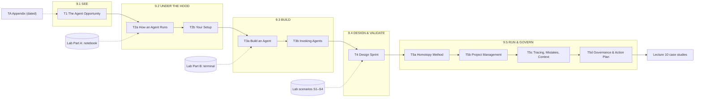
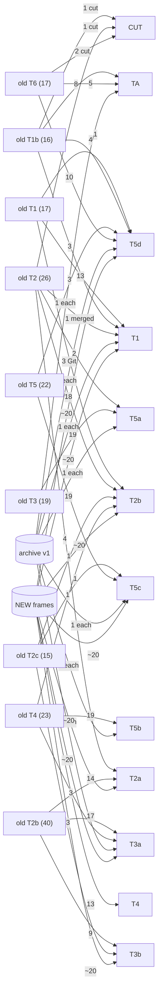

# Lecture 9 Reorganization Plan — "See → Under the Hood → Build → Design & Validate → Run & Govern"

Date: 2026-09-12 · Status: **v2 — approved with amendments** (`Lec09_Reorg_Plan_Review_2026-09-12.md`); Phases A and B complete on branch `lec09-reorg`, site updated on the branch; **not merged** · Supersedes the five-act structure of `Lec09_Rewrite_Plan_2026-07-06.md`.
Path shorthand: **L9** = `source/Lec09_Agentic_AI/`, **ROOT** = the repository root.

## 0. Plan v2 — status, amendments, and where the truth lives

v1 (sections 1–14 and the appendices below) is kept as the rationale. Where v1 and this section disagree, **this section wins**, and where either disagrees with the manifest, **the manifest wins**. The review (`Lec09_Reorg_Plan_Review_2026-09-12.md`) holds the evidence behind each amendment.

### 0.1 Decisions recorded on 2026-09-12
- The notes to rewrite are **the eleven slide decks** (Phase B). `Lec09_讲稿.md` stays a follow-up (§14).
- The hands-on parts run **live on Thu 2026-10-22 with mixed tools** (Claude Code, Codex CLI, Gemini CLI): the lab and the design exercise must pass on a second harness (A2).
- Accepted recommendations: delegation-economics spine (A3), capability ladder with Navier–Stokes demoted (A4), S2 as a transfer case (A6.2), T4 renamed *Design Lab*, baseline commit before archiving (A8.1).
- **2026-09-13:** the cold open uses an example from the instructor's own research — health insurance coverage by age — recorded as a real agent run from an empty folder (transcript in `labs/Lec09_Agent_Lab/transcripts/`). The borrowed homeownership example and its attribution are dropped. This supersedes the review's A9 line on the cold open.

### 0.2 Changelog v1 → v2
| # | Amendment | Changes to v1 |
|---|---|---|
| A1 | Tiers instead of cuts | Every frame carries `TIER: CORE / LAB / READ`; CORE (45 frames) is the Oct 22 path; replaces §13 decision 11's `% OPTIONAL` marks. Run sheet: `Lec09_RunSheet_2026-10-22.md` |
| A2 | Mixed tools | Portability spike (Gemini CLI 0.47.0, Codex CLI) before scenarios; harness-neutral brief; acceptance test at rung 3 (`labs/Lec09_Agent_Lab/scripts/detection_matrix.py`); harness mapping moves from TA to T2b (CORE); `agent_lab.py` Tier 2 generalized |
| A3 | Delegation-economics spine | Economic twin per part on map v2 and bridges; NEW T1 lens frame; Lec10 T9 added to §3, §9, §12; "collaborating with AI" owned by T5b |
| A4 | One capability ladder | Replaces the §2 ladder; T1 drops "Story 3" and the separate "Three Harnesses" frame; Navier–Stokes only in T3b §F and TA; GDP trace recorded for real |
| A5 | Accuracy | T1-F07 table, T1-F02 (9.x meanings), T1-F11 (seven cases), T5-F09 (clustering), T6-F07 (non-delegable, not incapable), T4-F15 (hook semantics), T5-F12 (AEA citation), T1b-F09 numbers → TA, T6-F04, T2c-F05 footer |
| A6 | Design Lab validates the design | T1b-F13 moves from T5d to T4; rubric grades rates over k=3, not one dispatch; S2 transfer case; rename; scenarios must pass on both harnesses |
| A7 | Framework registry | §0.4; at most five named frameworks at CORE |
| A8 | Safety and anchors | Baseline commit 515f50d on `main`; branch `lec09-reorg`; Appendix A made executable (`reorg_manifest.yaml` + `tools/lec09_assemble.py`); two phases; `CLI_FACTS_2026-09.md`; T5d disclosure frame |
| A9 | Small fixes | T3a is 20 + 2; `\LecNineMap{part}{sub}`; T5d k=0 finale last; one hub link + QR; whole syllabus block; cold-open attribution |

### 0.3 Where the truth lives now
| Question | Source of truth |
|---|---|
| Which old frame goes where, in what order, at what tier, with which reference edits | `reorg_manifest.yaml` (§6 and Appendix A below are superseded as specs) |
| Is every old frame accounted for; has an assembled frame drifted | `python3 tools/lec09_assemble.py check [--strict]` |
| Frame and tier counts | `python3 tools/lec09_assemble.py summary` — 219 frames: 45 CORE, 20 LAB, 154 READ; 36 new, 8 merged, 4 cut |
| What each deck owns and defers | the `owns` / `defers` lines in each deck header (generated from the manifest) |
| Dated CLI and harness facts | `CLI_FACTS_2026-09.md` (each fact labelled RUN / HELP / SRC / OPEN) |
| Outside claims (papers, policies, vendor and press reports) | `Lec09_External_Facts_2026-09.md` (each labelled PAGE / SEARCH / PRESS / BIB; rows to re-check at the gate) |
| Does a scenario work, on which harness, at what k | `labs/Lec09_Agent_Lab/transcripts/` (S1 k=3; S2 and S3 k=1; Claude Code only so far) and each run's `summary.json` |
| What the Oct 22 session teaches | `Lec09_RunSheet_2026-10-22.md` (the 45 CORE frames; minute budget is the instructor's call) |

### 0.4 Framework registry (A7)
| Framework | Owner | Cited by | Named at CORE? | Phase B action |
|---|---|---|---|---|
| The agentic loop | T1 (T1-F08) | T2a ReAct, Lab Part A | **yes** | keep |
| Eight steps = the eight-cell canvas | T3a (T2b-F13, F20) | T4, lab canvas | **yes** (one object) | present as one object |
| Three rungs | T3b (T2c-F02) | T4, lab Step 8 | **yes** | keep |
| Six homotopy steps + 5 pillars | T5a (T3-F03, T2-F23) | Lec10 T8 (labels verbatim), capstone | **yes** | keep verbatim |
| Seven tests | T5d (T1-F13 + T6-F06) | T1 teaser | **yes** | keep |
| Four research patterns | T1 (T1-F11) | Lec10 T1 (says "three") | no | keep the names (principle 8) |
| Four orchestration patterns | T1 (T1b-F04) | T3b wirings | no | keep the names, READ |
| Five plan-grading criteria | T5a (T3-F07) | T2b-F16 | no | keep, distinct by name |
| Four features; three components; four moving parts | T1; T2a; T2a | T3a F14 | no | unnumbered prose |
| Three error channels; three dials; three ceilings; three wirings | T3a; T3a/T3b; T3b; T3b | T3b, lab Part A | no | unnumbered prose ("the dials", "the ceilings") |
| Twelve commands; four zones; three memories | T2b | T3b, T5b | no | READ |
| Six instruments; three lifetimes; PM chain | T5b | syllabus | no | READ |
| Three operator mistakes; four mistakes at scale; Failure Cases 0–3 | T5c | — | cases only (FC0, FC1) | unnumbered where possible |
| Three things AI cannot do | T5d (T6-F07) | — | no | reframe as non-delegable responsibility (A5) |

### 0.5 Schedule and status (replaces §11)
| # | Step | Latest by | Status |
|---|---|---|---|
| 0 | Save review; baseline commit; branch | Sep 14 | **done** — review saved, `515f50d` on `main`, branch `lec09-reorg` |
| 1 | Plan v2 in place (this section); manifest with tiers; framework registry | Sep 16 | **done** — manifest + registry; this section |
| 2 | Portability spike + `CLI_FACTS_2026-09.md`; assembler dry run; map v2 compiled | Sep 19 | **done** — `8ef29c0`. Claude Code facts from runs; Gemini CLI 0.47.0 and Codex CLI 0.154.0 from help and source only (headless calls wait on a login) |
| 3 | Phase A: eleven decks compile, `check --strict` passes | Sep 23 | **done** — `d1da743` (all eleven compile ×2; page totals consistent) |
| 4 | Lab: brief format, rung-3 runner, setup check, S1–S3 on two harnesses (k=3), Ex.4 transcripts + replay | Oct 3 | **mostly done** — runner and setup check `527a6a0`; S1 k=3, S2/S3 k=1 on Claude Code `c50c337`, `4c56892`; S3 k=3 (all defects 3/3, controls silent) `cc3ac95`; GDP transcript `447f38f`; Part A Step 4b replay `b210d31`; cold-open session transcript `cc3ac95`. S2 k=3 (each specialist 3/3 on its own defects, controls silent), 13 Sep. **Open:** S1–S3 on a second harness (needs `gemini` or `codex` login) |
| 5 | Phase B: CORE frames in all decks (A3–A6), T4 deck | Oct 5 | **done** — `05e2a0a` (T1) … `3e2087a` (TA); T4 `c50c337` |
| 6 | Student setup announcement + harness survey (**instructor action**) | Oct 9 | open |
| 7 | Phase B: LAB/READ frames, TA; content freeze | Oct 12 | **done** — sweep `fc6cf74`; freeze after the QA fixes below |
| 8 | §10 A–K cross-references; QA gate; merge; publish; links live | Oct 16 | **on the branch, merge pending** — cross-references, syllabus, site pages, published PDFs (`ccd7c66`, `a5558ea`). QA gate run on 12 Sep: `check` clean, 219 frames tiered (45/20/154), page totals, `build_slides --check` and `check_site` clean; `claim-checker` on all 95 Phase B frames and `boundary-auditor` on seven topics. About 20 errors fixed (see `Lec09_External_Facts_2026-09.md`, "Corrections"); outside claims checked on the web and recorded there. **Awaiting the instructor:** merge to `main`, push, and the live-link check. |
| 9 | Freshness gate; run sheet; teams by harness | Oct 20 | open |

Phase B works deck by deck, CORE first, to the rewrite standard in the review (§5 there): one claim per frame in the bold lead; economic twin on map frames and bridges; harness-neutral concepts with verified per-harness boxes; tagged and sourced numbers; no deck-history self-reference; at most five named frameworks at CORE. Delete a frame's `% ---- ID` marker only when its Phase B rewrite is done; `check` then stops tracking it.

### 0.6 Verification added by v2 (on top of §12)
- End of Phase A: `lec09_assemble.py check --strict` clean; all decks compile ×2; no `/ 100` page totals (poppler is not installed here — check totals with PyMuPDF).
- Must be empty in the decks at the end of Phase B: `six cases`, `Cases 4--6`, `Can run Python`, `cluster at county`, `categorically outside`, "rejected" in the hook frame, `Placeholder --- written in Phase B`, `MERGE-PENDING`, `TODO(Phase B)`. Hand-review every `\b9\.[1-5]\b` hit.
- Must hit: Lec10 T9 / Case 7 in T1 and T5c/T5d; the economic twin on every map frame; the harness mapping table in T2b.
- Course agents: `boundary-auditor` on the ownership lines; `claim-checker` on every NEW or EDIT frame with a number; external dated claims web-verified with a date.
- Portability: Step 0 detects `claude`, `gemini`, `codex`; S1–S3 at k=3 on each tested harness; one dry run of the 50-minute Design Lab with two harnesses in the room.

### 0.7 Close-out (2026-09-13)

**State.** All work is committed on branch `lec09-reorg` (baseline `515f50d` on `main`). It is **not merged or pushed**: nothing is live on the public site until the instructor approves.

**Before merging, re-run:**
```bash
python3 tools/lec09_assemble.py check        # 195 source frames, 0 errors, 0 drifted
python3 tools/build_slides.py --check         # 0 stale, 0 unresolved
python3 tools/check_site.py                   # all checks passed
```

**Merge and publish (instructor):** `git checkout main && git merge --no-ff lec09-reorg && git push`. Then check that the eleven `slides/Lec09_*.pdf` links, `labs/`, and the T4 QR code (the labs hub) resolve.

**Open items**

| Item | Who | By | How |
|---|---|---|---|
| Merge and publish | instructor | Oct 16 | above |
| S1–S3 on a second harness, k=3 | instructor logs in; then re-run | Oct 16 | fix Gemini CLI auth or `codex login`; `python3 scripts/detection_matrix.py scenarios/S1_aiyagari_audit --harness codex --k 3` (and S2, S3) |
| Student harness survey and setup announcement | instructor | Oct 9 | Step 0: `python3 scripts/setup_check.py --live` |
| Minute budget for the 45 CORE frames | instructor | Oct 16 | `Lec09_RunSheet_2026-10-22.md` |
| Dry run of the 50-minute Design Lab with two harnesses | instructor | Oct 20 | T4 |
| Freshness gate | Oct 19–20 | Oct 20 | `tools/lec09_cli_probes.sh`; update `CLI_FACTS_2026-09.md`; re-check the rows marked re-check in `Lec09_External_Facts_2026-09.md` (Navier–Stokes, Codex Goal Mode, METR per-model minutes) |
| 讲稿 rewrite (follow-up) | — | after Oct 22 | known drift: OpenAI's MCP date (still DevDay, Oct 2025), "four" broken benchmarks (eight), the old hooks table |

**Found outside Lecture 9, not changed here**
- `source/Lec07_LLM/Lec07_T5b_Applications_Validation.tex:665` and `source/Lec08_RAG/Lec08_T5_Research_Applications_Demo_Eval.tex:444` repeat the unsourced "AEA … October 2024" disclosure claim that T5d replaced with the quoted AER rule.
- `Lec10_T4_Case3_ESFellows.tex:84` dates the roster April 14, 2026; `Lec10_T7_Synthesis_Appendix.tex:261` says April 13. T4's age-status counts (44 + 1 + 836) sum to 881, not the 882 on its roster slide.
- `source/Docs/Capstone_Projects_2026.md:526-528` still lists the Goldsmith-Pinkham guides; `figures/homeownership_by_age.jpg` is no longer used by any live deck.

## 1. Context

Lecture 9 (Agentic AI for research workflows) has grown by accretion. The July 2026 rewrite gave five decks a "one map, five acts" spine (T1 MAP, T2 MACHINE, T3 METHOD, T4 MANAGEMENT, T5 MINDSET) with T1b (landscape) and T6 (wrap/appendix) as satellites. September then added two large decks outside that map — T2b *Anatomy of an Agent* (40 frames: session-as-list, the eight-step agent build, the Agent Design Canvas, tool/skill/sub-agent, a six-frame GDP-growth-by-party worked example) and T2c *Invoking Agents* (15 frames: implicit/named/scripted rungs, the ten-thousand-agent run, a cost ledger) — plus a complete offline lab (`labs/Lec09_Agent_Lab/`) and three course-level reviewer agents (`.claude/agents/`). T2b, T2c, the lab and the agents are all still **untracked in git**.

Result: 9 decks, 195 content frames, a map that no longer matches the decks, a dozen near-duplicate frames, dated facts scattered across T1b/T2c, and no deck that tells students what to *do* in class. The goal is a clear agenda and structure tailored to economic research, borrowing the workshop arc **See → Design → Validate** (Agent Opportunity → Live Demo → Design Sprint → Pitch & Validate → Governance & Action Plan). Length and clock-fit are explicitly not the priority; content can be dropped at deployment.

The seven asks and where they land:

| # | Ask | Lands in |
|---|---|---|
| 1 | Landscape: chatbox → agentic AI → thousands of agents; motivating examples | T1 (Part 9.1), opened by the example ladder in §2 |
| 2 | Chatbox vs agentic AI | T1 §B |
| 3 | Under the hood: harness; chat vs Copilot vs Claude Code; `.claude`/agents/memory layout; key commands | T2a + T2b (Part 9.2) |
| 4 | Build an agent from scratch; skill vs agent; implicit/explicit/scripted invocation; detailed examples | T3a + T3b (Part 9.3) |
| 5 | Hands-on economics exercise with clickable links to notebooks/examples | T4 (Part 9.4) — new deck + new lab scenarios |
| 6 | Advanced: design, improve, organize, trace mistakes, collaborate with AI | T5a–T5d (Part 9.5) |
| 7 | Inventory of existing slides for copy-paste into the new set | Appendix A (every frame → new home) |

## 2. Motivating examples — the lecture's hook

> **v2 (A4):** superseded by one capability ladder — chat window (Fellows in chat) → one agent, one sitting (six minutes) → files, many sittings (882 Fellows) → human gates, weeks (HA-Ramsey; counter-rung Lec10 T9) → team of sub-agents (the ledger) → scripted fan-out + verifier (Lec10 T6b). The GDP trap spans every rung; Navier–Stokes is a dated sidebar in T3b and TA only.

The lecture opens on a **ladder of six real examples**, ordered by how long the agent worked, from six minutes to eighty-eight hours. Each rung shows what the agent did, what the economist still had to do, and the failure that would have gone unnoticed without that economist. Every example already exists in the course material; T1 shows the ladder once, and each later part returns to its rung.

```
   6 min            5 requests          1 week              weeks, not years      24 min (this deck)     88 hours
   ┌────────┐       ┌──────────┐        ┌──────────┐        ┌──────────────┐      ┌────────────────┐     ┌──────────────┐
   │ Ex.1   │       │ Ex.4     │        │ Ex.2     │        │ Ex.3         │      │ Ex.6           │     │ Ex.5         │
   │ empty  │  ───▶ │ GDP by   │  ───▶  │ 882 ES   │  ───▶  │ HA-Ramsey    │ ───▶ │ four agents    │ ──▶ │ 10,000       │
   │ folder │       │ party    │        │ Fellows  │        │ paper        │      │ wrote T3a §B   │     │ agents       │
   │→ figure│       │(the trap)│        │(provenance)│      │(3 discoveries)│     │(the ledger)    │     │(the verifier)│
   └────────┘       └──────────┘        └──────────┘        └──────────────┘      └────────────────┘     └──────────────┘
   what stayed      the question ·      the identification · the schema and       the timing bug and     the four briefs ·      the checker and
   human:           the check           judgment            the provenance rule   "what is interesting"  the four mistakes      the rubric
   returns in:      T1 cold open        T2a §C, T4 S2       T2b §D, T5c, T4 S3    T5a, T5b, T5d          T3b §G, T5c            T1, T3b §F
```

| # | Example | What the agent did | What stayed human | Source material |
|---|---|---|---|---|
| 1 | **Six minutes, one figure** — Goldsmith-Pinkham's empty-folder-to-figure session (homeownership by age) | 3 prompts; FRED lacked the disaggregated series → pivoted to Census HVS unprompted; hit HTTP 403 → added a User-Agent; 2 CSVs, 77 lines of R, one figure, 6 min 21 s | chose the question; checked the figure | archive v1 §Case Study (4 frames); `figures/homeownership_by_age.jpg` exists |
| 2 | **One week, 882 rows with provenance** — Econometric Society Fellows dataset | 18 batches of 50; source URL per field; 527 profile pages + 316 CVs parsed | the schema; the provenance rule; redesigning the variable when birth year stayed unknown for 836/882 | T1-F04, T2-F15..F18, T4-F15, T5-F11, Lec10 T4 |
| 3 | **Weeks, not years, one paper** — HA-Ramsey from a validated RA seed | full heterogeneous-agent codebase; 32+ configuration sweeps; three methodological discoveries (alpha-shapes, viability kernel, Lyapunov penalty); two papers | caught the timing bug and the transition-direction bug; decided what was interesting; signed every milestone gate | T1-F03, T3-F06/F10/F13, T4-F03/F04/F05/F20, T5-F20, Lec10 T8 |
| 4 | **Five requests, one trap** — "plot and rationalize how party affiliation affects GDP growth" | five API requests; one error recovered (plot backend); the party timeline written from memory with no source; a plot | noticing that "rationalize" is a leading verb; effective n ≈ six administrations; Blinder–Watson (2016) ≈ 1.8 pp is not identification | T2b-F33..F38 (six frames) |
| 5 | **Ten thousand agents, eighty-eight hours** — the Navier–Stokes run (and the course's own 11,171-of-13,225 labelling run) | ~10,000 agents, ~5 M messages, ~300 B tokens, "several million dollars"; +17 h Lean check; disputed | the verifier: nothing counted until a checker could reject it; for the course run, a 20-minute rubric and 12 labels read by eye | T2c-F06..F09 (`[hype]`-tagged), Lec10 T6b |
| 6 | **This deck, partly written by agents** — the T2b §2 ledger | four sub-agents, 448,576 tokens, 122 calls, 23.8 min (5.6 min wall clock vs 13.5 sequential); four mistakes, including paying twice for one answer | the four briefs; the decision to keep only read-only agents in parallel | T2c-F10..F13 |

The second hook is the **capability ladder** students climb during the lecture — the same picture that answers "why is Copilot not an agent?":

```
   CHATBOX ──(+ tool calls, + your files)──▶ IDE COPILOT ──(+ shell, + loop, + memory on disk)──▶ TERMINAL AGENT
      │ answers                                 │ edits the file you have open                      │ runs, observes, retries; leaves files behind
      └── T1 §B ─────────────────────────────────┴── T1 "three harnesses" ───────────────────────────┴── T2a / T2b

   TERMINAL AGENT ──(+ agent files, + isolated contexts)──▶ ORCHESTRATED TEAM ──(+ scripts, + a checker)──▶ SWARM (10^4)
      │ one loop                                          │ one loop dispatching others (T3a, T5b)           │ nobody chooses; the verifier decides (T3b)
```

## 3. What exists today (inventory summary)

Frame-by-frame dispositions are in **Appendix A**; archive items in **Appendix B**. Headline facts (verified against the files):

- **Current decks** (L9): T1 (17 frames), T1b (16, facts dated June 2026), T2 (26), T2b (40, Sep 4–12), T2c (15, Sep 12), T3 (19), T4 (23), T5 (22), T6 (17). Archive: three monolithic decks (v1 80, v2 77, v3 89 frames). `Lec09_讲稿.md` is title-locked to the pre-July frames (already desynced).
- **Near-duplicates**: JSON tool-call frame ×3 (T1-F07 / T2-F03 / T2b-F02); "you own vs agent provides" ×3 (T1-F12 / T2-F24 / T4-F04); evaluation checklist ×3 (T1-F13 five tests / T2-F25 / T6-F06 six criteria); loop diagram ×2 (T1-F08 / T2-F17); context-engineering ×3 (T1b-F07 / T2-F21 / T2-F22); dispatch-is-a-tool-call argued (T2b-F26/27, CLI 2.1.261) and exhibited (T2c-F03, CLI 2.1.269); identical bridge boilerplate in every deck.
- **Defects**: T2b's agenda omits its own §6 worked example; T2b/T2c/T1b/T6 have no map frame; T6 carries a `% TODO Pass B` note; T2c-F12 has a self-referential claim ("your six agent files have never run"); T2c-F06 says "four days old"; T3:153 cites a "T2 step 0" that does not exist; T2:94 attributes JSON tool calls to "Lec07 T3a" but they live in `Lec07_T4_Pretraining_Alignment.tex`; T6-F11 duplicates T5-F21/T6-F10; the July rule "MCP appears ONLY in T1b" is already broken by T1:443.
- **Hard dependencies (must survive)**: `Lec10_T8_Case6_DeepRamsey.tex` cites "Lec09 T3" five times (lines 11, 235, 240, 269, 610) and reproduces T3's six-step labels (T3:98–103) verbatim; it paraphrases the restate-the-spec sentence (T3:175); `Lec07_T4` (266, 283, 296) points to "the context dilemma" and the JSON preview without deck numbers; `Lec10_T1` relies on the four research-pattern names (it says "three" — pre-existing nit); the capstone brief cites Lecture 9 for the 5-pillar workflow and the skills/agents/rules vocabulary (Track D2); `Lec10_T6b` owns the 13k-call numbers; `\LecNineMap{0}` (all-complete) is used by T5-F21.
- **Lab already built** (offline, no API key): Part A notebook (9 steps, scripted model), Part B terminal walkthrough (8 steps ending with the three rungs), the 8-cell canvas, six lab agents, a flawed Aiyagari solver, an instructor key. All nine agent files follow one house pattern (a `description` whose last clause names what the agent does NOT do; `tools:` = blast radius; `model:` = budget; "say so rather than inventing an issue") — the eight-step canvas instantiated nine times.
- **Link plumbing**: `shared_preamble.tex` loads hyperref (`urlcolor=RedTitle`); site https://vonzhg.github.io/AI-ECON-2026/; labs are linked as `https://github.com/vonzhg/AI-ECON-2026/blob/main/labs/…` plus Codespaces. Lec10 decks are **not** published on the site (only a ComingSoon placeholder), so Lec10 links must use the tracked source PDFs.
- **Build tooling**: `tools/build_slides.py` excludes any path component named `_archive` and matches deck names on an underscore boundary (`stem == d or stem.startswith(d + "_")`, lines 141–143), so old and new `Lec09_T1_*` masters cannot coexist; it only *reports* orphaned published PDFs ("NO MASTER"), it does not remove them. `source/build_all_topic_decks.sh` prunes only `archive_pre_split/`.

## 4. Design principles

1. **One agenda, five parts, each answering one student question.** Part number = agenda item; letters = sub-decks (house style: Lec10 T6a/T6b).
2. **Every deck opens with the same map** (`lec09_map.tex` v2). No agenda frames.
3. **One owner per topic** (§9 ownership map). Duplicates get exactly one home; everyone else cross-references with a forward-looking phrase ("T5d returns to…"), never "as T5d showed".
4. **Durable core, dated edges.** Model versions, prices, benchmark scores, the Navier–Stokes run live in `[solid]/[hype]`-tagged frames (T1 timeline, T1 §C, T3b §F, T5d measuring) or in the Appendix deck. One "verified on Claude Code <ver>, <date>" footnote per deck, not per frame.
5. **Economics threads, not toy demos** (§2 ladder): HA-Ramsey, ES Fellows, Aiyagari (the lab's flawed solver), GDP-growth-by-party, the OLG demo, MEPS via Lec10.
6. **A picture on every mechanism frame.** Existing TikZ is reused wherever it exists; §8 lists the new figures to draw.
7. **Every hands-on frame carries a clickable link** (`\href{url}{\texttt{path}}`, URL repeated in a footnote for print).
8. **Preserve what other lectures cite verbatim** (six-step labels, restate-the-spec sentence, "Context Dilemma", four pattern names, 5-pillar names) and fix the five inbound "Lec09 T3" strings.

## 5. The new agenda

> **v2:** T4 is *Design Lab* (`Lec09_T4_Design_Lab.tex`); the map is `\LecNineMap{part}{sub}` with sub-deck chips and each part's economic twin; frame counts come from `lec09_assemble.py summary` (T1 19, T2a 17, T2b 26, T3a 22, T3b 21, T4 14, T5a 24, T5b 20, T5c 21, T5d 21, TA 14).

### 5.1 Structure map (this is also the spec for the new `lec09_map.tex` slide)

```
 ┌───────────────┐   ┌──────────────────────┐   ┌──────────────────────┐   ┌────────────────────┐   ┌──────────────────────────────┐
 │ 9.1  SEE      │──▶│ 9.2  UNDER THE HOOD  │──▶│ 9.3  BUILD           │──▶│ 9.4  DESIGN &      │──▶│ 9.5  RUN & GOVERN            │
 │               │   │                      │   │                      │   │      VALIDATE      │   │                              │
 │  T1           │   │  T2a      T2b        │   │  T3a      T3b        │   │  T4                │   │  T5a   T5b   T5c   T5d       │
 │  what changed,│   │  how does it run?    │   │  how do I build one, │   │  can I design one  │   │  how do I run a project,     │
 │  and why care?│   │  how do I start?     │   │  and how do I call it│   │  and prove it works│   │  catch my mistakes, stay safe│
 └───────────────┘   └──────────────────────┘   └──────────────────────┘   └────────────────────┘   └──────────────────────────────┘
        ╎                       ╎                         ╎                          ╎                            ╎
   Appendix TA            Lab Part A               Lab Part B                Lab scenarios               Lecture 10 cases
   (dated landscape,      (notebook, offline)      (terminal, real agents)   (S1–S4, canvas, rubric)     (T4 Fellows, T8 HA-Ramsey)
    setup details)
   HOW IT WORKS ◀──────── 9.1 – 9.2 ────────▶   HOW TO BUILD & USE IT ◀── 9.3 – 9.4 ──▶   YOUR ROLE ◀──────── 9.5 ────────▶
```

### 5.2 Teaching flow (Mermaid; renders on GitHub and in VS Code)



### 5.3 Deck table

| Part | Student question | Deck | Title | Built from | ≈frames |
|---|---|---|---|---|---|
| **9.1 SEE** | What changed, and why should an economist care? | T1 | The Agent Opportunity: From Chatbox to Agent Swarms | T1; T1b-F04/F06/F09; T2c-F06/07 teaser; archive "empty folder → figure"; NEW timeline + ladder + "three harnesses" | 22 |
| **9.2 UNDER THE HOOD** | How does it actually run, and how do I start? | T2a | How an Agent Actually Runs: Harness, Session, Loop | T2 §Machine; T2b §1 + §6 (GDP example) | 17 |
| | | T2b | Your Setup: Files, Commands, First Session | T2 §Start/§First/§Budget; T1 Git; T4-F10; T2c-F12; NEW `.claude` tree | 26 |
| **9.3 BUILD** | How do I build an agent, and how do I call it? | T3a | Build an Agent From Scratch: Eight Steps, One Canvas | T2b §2 + §5; T4-F12/F13/F14; archive "skills in the wild" | 22 |
| | | T3b | Invoking Agents: One, Three, Ten Thousand | T2b §3 + §4 + §7; T2c §1–§3 | 21 |
| **9.4 DESIGN & VALIDATE** | Can I design one for my own question, and prove it works? | T4 | Design Sprint: Your Agent for an Economics Task | NEW deck; lab Part B; canvas; four scenarios | 13 |
| **9.5 RUN & GOVERN** | How do I run a whole project, catch my mistakes, and stay safe? | T5a | Method: The Homotopy Workflow | T3 wholesale; T2-F23/F25; archive prompting frame | 22 (+2 opt) |
| | | T5b | Management: Organize the Project, Run the RA Team | T4 minus moved frames; archive corrections-file pattern | 20 |
| | | T5c | Mindset: Trace Mistakes, Manage Context | T5-F02..F11, F13..F19; T2c-F13; archive pillar anchors | 21 |
| | | T5d | Governance and Action Plan | T5-F12/F20/F21; T1b-F12..F15; T6-F02..F12; NEW 30-day plan; archive first-exercise prompt | 21 |
| Appendix | (not taught in sequence) | TA | Appendix: The Landscape (Dated), Setup Details, References | T1b remainder; T6-F13..F17; archive harness-file map | 15 |

Total ≈ 220 frames (195 today). Workshop-arc mapping: Agent Opportunity = 9.1 · Live Demo = 9.2–9.3 (the eight-step build is the "proven methodology"; the GDP trace and lab transcripts are the live parts) · Design Sprint = 9.4 first half · Pitch & Validate = 9.4 second half · Governance & Action Plan = 9.5d.

New file names (build glob `Lec*_T*.tex` still matches): `Lec09_T1_Agent_Opportunity.tex`, `Lec09_T2a_How_an_Agent_Runs.tex`, `Lec09_T2b_Setup_Files_Commands.tex`, `Lec09_T3a_Build_an_Agent.tex`, `Lec09_T3b_Invoking_Agents.tex`, `Lec09_T4_Design_Sprint.tex`, `Lec09_T5a_Homotopy_Method.tex`, `Lec09_T5b_Project_Management.tex`, `Lec09_T5c_Tracing_Mistakes_Context.tex`, `Lec09_T5d_Governance_Action_Plan.tex`, `Lec09_TA_Appendix_Landscape.tex`.

### 5.4 Where the old frames go (edge labels = frames; totals reconcile with Appendix A)



## 6. Per-deck outlines

> **v2:** the authoritative order, tiers and edits are in `reorg_manifest.yaml` (assembled in `d1da743`). The outlines below remain the rationale. Differences from them: T1 drops Story 3, the subjects frame and the separate Three Harnesses frame, and gains the principal–agent lens frame; T2b's `.claude` tree becomes the harness-neutral *Project Files Across Harnesses*; T3b edits in v1 attributed to T2b-F27 actually live in T2b-F26; T1b-F13 moves to T4; T5d gains the disclosure frame and ends on the k=0 job description before its bridge; TA loses the harness-file mapping (now T2b).

Tags: [KEEP] as-is (refs updated) · [EDIT] content change · [MERGE a+b] · [MOVE] · [NEW] · [OPT] droppable (mark `% OPTIONAL` in the source). IDs and line numbers in Appendix A. House voice unchanged (bold lead sentence, "Why this matters for economists", tcolorboxes, no `\framesubtitle`, `[fragile]` on listings). Every deck except TA opens with `\LecNineMap{k}` (k = part number; T5d's job-description frame uses k=0).

### T1 — The Agent Opportunity: From Chatbox to Agent Swarms (Part 9.1, ~22)
Sections: *9.1A The Agent Opportunity* / *9.1B Chat, Copilot, Agent* / *9.1C The Landscape in Four Frames* / *9.1D What This Means for Research*
1. [NEW from archive v1 §Case Study] Cold open — Six Minutes, One Figure: the empty-folder-to-figure session; the figure, the three prompts, the two obstacles the agent solved unprompted; "what did the economist do?" (asks the question, checks the figure). No map yet: the hook comes first.
2. [EDIT T1-F01] Lecture 9 in One Map — map v2 k=1; five questions; the threads.
3. [KEEP T1-F02] Execution Is the Bottleneck.
4. [NEW] The Ladder of Examples: Six Minutes to Eighty-Eight Hours — the §2 ladder as one TikZ strip (six rungs; agent's work above, human's work below; where each returns).
5. [NEW] From Chatbox to Agent Swarm, 2022–2026 — timeline TikZ: 2022 chat · 2023 structured tool calls + IDE copilots · 2024 terminal agents, MCP (Nov 2024, T1b:71) · 2025 sub-agents, orchestrator–worker, A2A, frameworks at 1.0 (T1b:135–145), OpenAI adopts MCP (T1b:72), AAIF (T1b:73) · 2026 scheduled autonomous runtimes (T1b:253–260) and four-digit swarms (T2c:249). Each fact tagged; closing line from T1b-F16. MCP is *named* here once; explained only in TA.
6. [KEEP T1-F03] Story 1 — HA-Ramsey: Weeks, Not Years (Ex. 3).
7. [KEEP T1-F04] Story 2 — 882 Fellows (Ex. 2).
8. [NEW from T2c-F06+F07] Story 3 — Ten Thousand Agents in 88 Hours, and What Made It Bankable (Ex. 5) — condensed table; groups/framings/a human/a verifier in one sentence; `[hype]` on the numbers; "full ledger: T3b §F".
9. [OPT NEW] Agents as Subjects, Not Workers — LLM agents as simulated economic agents (Horton 2023 "Homo Silicus"; Park et al. 2024 generative-agent simulations of 1,000 people); one caution line. Verify citations before use.
10. [KEEP T1-F05] What Modern Web Chat Already Does Well.
11. [KEEP T1-F06] What Breaks Without a Harness: The Fellows Test.
12. [EDIT T1-F07] Chat vs. Agent: Same Brain, Different Arms — keep the table; delete the JSON paragraph (T1:148–151; T2a owns it); footer "T2a opens the loop".
13. [NEW] Three Harnesses Around the Same Model — the §2 capability ladder as a figure: chat (claude.ai) / IDE copilot (Cursor, Copilot) / terminal agent (Claude Code, Codex CLI) × what each *sees*, *does*, *remembers*, and who presses "run". Harvest the strengths lists from archive v1:794–878. This is the frame that answers "why is Copilot not an agent?".
14. [KEEP T1-F08] The Agentic Loop.
15. [KEEP T1-F09] Four Features.
16. [EDIT T1-F10] The Spectrum, and Our Featured Tool (T1:246 "T3 returns to tool choice" → "T5a").
17. [EDIT T1b-F04] Four Orchestration Patterns — OWNER of the pattern names; rewrite T1b:122 forward-looking ("the workflow you will build in Part 3 and run as the RA team in T5b is an orchestrator–worker system").
18. [EDIT T1b-F06] The Multi-Agent Cost–Benefit Decision — `[hype]` on +90.2%/15×; T1b:171 "in T4" → "in T5b".
19. [KEEP T1b-F09] How Long Can an Agent Actually Work? — dated tag; footer "the rest of the landscape, dated: Appendix TA".
20. [KEEP T1-F11] Four Research Patterns Across the Lec10 Cases (Lec10 depends on the names).
21. [MERGE T1-F12 + two rows of T2-F24] What Remains Human — T1:297 "In 9.4" → "In 9.5"; footer = one-line teaser of the seven tests (T5d owns the table). T5b's contract frame is the formal owner of division of labor.
22. [EDIT T1-F17] Bridge: Open the Hood — no "optional interlude"; new arc line.
Bridge sentence: *"You have seen what agents do and what proper use produced. The question changes from 'what is this?' to 'how does it actually run, and how do I start?' — T2a opens the loop in machine language; T2b puts it on your laptop."*
CUT: T1b-F07 (dup of T2-F21/F22 + T2b-F24); T1-F13 → T5d. T1 Git frames → T2b.

### T2a — How an Agent Actually Runs: Harness, Session, Loop (Part 9.2, ~17)
Sections: *9.2A Three Components and One JSON Line* / *9.2B The Session Is a List* / *9.2C Worked Example — GDP Growth by Party*
1. [NEW] Map k=2 (absorbs T2b-F01's "three beliefs, corrected" line as a pointer to T3b's table).
2. [KEEP T2-F02] Three Components: Harness, LLM, Your Files.
3. [MERGE T2-F03 + T2b-F02] From One JSON Line to a Running Loop — T2b's three-node diagram + T2's four bullets; fix "Lec07 T3a" → "Lec07 T4".
4. [KEEP T2-F04] Privacy Boundary.
5–9. [KEEP T2b-F03, F04, F05, F06, F07] Who is speaking; the session is a list; four moving parts; the loop in twenty lines; ReAct named.
10. [EDIT T2b-F08] So Where Does the Agent Live? (T2b:302 "T2 wrote" → "the JSON frame said").
11–12. [KEEP T2b-F33, F34] The task and the trap (Ex. 4); every message on the wire.
13. [EDIT T2b-F35] What Went Into `req 1` (T2b:1448/1458/1473 "T2's" → "T2b's, next deck").
14–15. [KEEP T2b-F36, F37] Reading the trace; the same task with three agents.
16. [EDIT T2b-F38] What the Reviewer Says (T2b:1575 "T5" → "T5c").
17. [NEW] Bridge: *"You have watched the loop on the wire, once with one agent and once with three. Next: put that loop on your own machine — install it, learn its files and commands, run your first session (T2b)."*

### T2b — Your Setup: Files, Commands, First Session (Part 9.2, ~26)
Sections: *9.2D Terminal, Install, Git* / *9.2E Files: Where the Agent Reads From* / *9.2F The Control Surface* / *9.2G Your First Session* / *9.2H Budget*
1. [NEW] Map k=2.
2–4. [KEEP T2-F05, F06, F07] Terminal vocabulary; pieces fit; install once (exact commands → TA).
5. [MERGE T1-F14 + T1-F15] Git Is the Safety Net (time-machine TikZ + risk/benefit columns).
6. [KEEP T1-F16] Git Setup: Four Steps (Hand It to Your Agent).
7. [EDIT T2-F08] Files First: Global vs. Local (T2:244 "T4" → "T5b").
8. [NEW] The `.claude` Tree, Annotated — TikZ directory tree drawn from paths that `ls` confirms on this machine: `~/.claude/{settings.json, CLAUDE.md, skills/, agents/, projects/<proj>/memory/}` and `<project>/{CLAUDE.md, .claude/{settings.json, settings.local.json, agents/, skills/, rules/}}`; side column "`AGENTS.md` / `.codex/` / `.gemini/` analogs → TA table"; live examples: `ROOT/.claude/agents/`, `labs/Lec09_Agent_Lab/.claude/agents/`, `demos/M4_olg_5step_demo/.claude/skills/olg-5step/SKILL.md`.
9. [KEEP T2-F09] Initialization: What Happens When You Type `claude`.
10. [MOVE T4-F10] Three Memories, Three Writers.
11. [EDIT T2c-F12] Where an Agent Lives: Type, Brief, Report, File — keep the four-row lifetime table and the resolution rule; strip the caution box T2c:445–447 and the "it never ran" clause; "T4's resolution rule" → "the global-vs-local rule above".
12. [KEEP T2-F10] The CLI at a Glance: Four Zones.
13. [EDIT T2-F11] Commands (1) (T2:338 "(T4)" → "(T5b)").
14. [EDIT T2-F12] Commands (2) — add one pointer row: "`/agents` — inspect which specialists are in scope (T3b)". Decision: the rung surfaces (`/agents`, `--agent`, `--agents`) stay in T3b with their argument; T2b owns the twelve commands, modes, permissions.
15. [KEEP T2-F13] Modes, Keys, and the Rest (T2:429 "/hooks (T4)" → "(T5b)").
16. [KEEP T2-F14] Permissions: The Blast-Radius Dial.
17. [OPT NEW] One-Page Cheat Sheet — 13 commands, 3 modes, 5 keys, linked to the official docs.
18–21. [KEEP T2-F15, F16 (T2:565 "T3 gives the five criteria" → "T5a gives the five plan-grading criteria"), F17, F18] First Session (1)–(3), What It Leaves Behind (Ex. 2).
22. [EDIT T2-F19] Close the Loop (T2:670 "T4" → "T5b").
23–24. [KEEP T2-F20, F21] Tokens and cost; the context window.
25. [EDIT T2-F22] Compaction (T2:744 "T5" → "T5c"; footnote with `/compact <focus>` syntax and the ~20-turn heuristic from archive v1, tagged dated).
26. [NEW] Bridge: *"You can install, launch, steer, budget, and read the screen. In the lab folder sit six agent files you have not yet written. Part 3: build one from scratch (T3a), then learn the three ways to call it (T3b)."*

### T3a — Build an Agent From Scratch: Eight Steps, One Canvas (Part 9.3, ~22 + 2 opt)
Sections: *9.3A Why Three Agents* / *9.3B The Eight Steps* / *9.3C Tool, Skill, Sub-Agent, Rule*
1. [NEW] Map k=3.
2–3. [KEEP T2b-F09, F10] Three backgrounds; three error channels.
4. [EDIT T2b-F11] Hire Three Students, or Write Three Job Descriptions (T2b:432 "T5" → "T5c").
5. [EDIT T2b-F12] The Trio by Background (T2b:445/483 "T4 sorts" → "T5b sorts").
6. [EDIT T2b-F13] Eight Steps, Eight Artifacts (T2b:487 "T3's ladder" → "T5a's").
7–10. [KEEP T2b-F14, F15 (T2b:595 "(T1b)" → "(T5d)"), F16, F17] Steps 1–2, 3–4, 5–6, 7–8 — sync the agent-file listings to the real files (T2b-F14/F20 currently abridge `code-reviewer.md`/`math-agent.md`).
11. [OPT KEEP T2b-F18] `tooling-agent` at Work (T2b:741 "T4's login-vs-compute" → "T5b's").
12. [OPT KEEP T2b-F19] From Markdown to a Language You Read.
13. [EDIT T2b-F20] The Agent Design Canvas: Eight Cells, One Worked Answer (footer "(§4)" → "T3b"; "blank canvas in the lab folder" → `\href` to the canvas, and "T4 hands you the blank one").
14. [EDIT T2b-F21] Steps 2–4 Are the Three Dials (internal bridge; T2b:860 "§3/§4" → "T3b").
15. [KEEP T2b-F29] The Usual Definition Describes a Tool, Not a Skill.
16. [MERGE T2b-F30 + T4-F13] What a Skill Actually Is: Progressive Disclosure — folder tree above the SKILL.md listing; T2b:1293 "§4" → "T3b"; "T4 taught you when" → "T5b returns to when".
17. [EDIT T2b-F31] Tool, Skill, Sub-Agent: Where the Reasoning Lives (T2b:1297 "T4 sorted" → "T5b sorts"; Rules footnote → T5b).
18. [EDIT T2b-F32] `disable-model-invocation: true` (T2b:1338 "T4's third category" → "T5b's").
19. [MOVE T4-F12] Plain English vs. Encoded Skill (capstone D2 note travels with it).
20. [MOVE T4-F14] Skills Are Saved Research Playbooks.
21. [NEW from archive v1:1561] Economist-Authored Skills in the Wild — Sant'Anna `review-paper`/`data-analysis`, Blattman `proposal-write`, plus the course's own Lec10 T2 review-paper as example 4; re-verify the repo URLs (v1:1591).
22. [NEW] Bridge: *"One agent is one Markdown file with a description that does the work. Next: how do you actually call it — by description, by name, by script — and what does a run of ten thousand consist of? (T3b)"*

### T3b — Invoking Agents: One, Three, Ten Thousand (Part 9.3, ~21)
Sections: *9.3D Many Agents* / *9.3E Three Rungs* / *9.3F Four-Digit Runs* / *9.3G The Ledger* / *9.3H Synthesis*
1. [NEW] Map k=3 (+ T2c-F01's "the claim this deck defends" takeaway: "the number of agents you run is a verification decision").
2. [KEEP T2b-F22] Three Dials Make an Agent.
3. [EDIT T2b-F23] How Many at Once? (T2b:951 "T1b priced" → "T1 priced").
4. [EDIT T2b-F24] Isolated Context Is the Point (T2b:1004 "T5" → "T5c").
5. [EDIT T2b-F25] Three Wirings (T2b:1060 "T1b's … T4's RA team" → "T1's … T5b's").
6. [KEEP T2b-F26] The Router Myth.
7. [EDIT T2b-F27] Dispatch Is a Tool Call — Evidence (T2b:1118 "T2 said" → "T2a said"; :1121 "T1b's think-budget routers" → "TA's"; one CLI version string, footnoted).
8. [KEEP T2b-F28] Auto-Dispatch vs. Hand-Wired.
9. [EDIT T2c-F02] The Question T3a Left Open: Three Rungs (T2c:97/101 "T2b's §4" → "§D above").
10–12. [EDIT T2c-F03, F04, F05] Rung 1 / Rung 2 / Rung 3 (T2c:105/138/139 "T2b's §2/§4" → "T3a step 4/5", "§D"; :177 "T2's twelve" → "T2b's twelve"; :233 "T2b's §2 step 8" → "T3a step 8").
13. [EDIT T2c-F14] Choosing a Rung Is One Question (T2c:479/489/499 → "§D", "T3a").
14. [EDIT T2c-F06] What About Ten Thousand Agents? (Ex. 5; drop "four days old here"; keep "disputed two frames on" only because F07→F08 stay adjacent).
15. [EDIT T2c-F07] Groups, Framings, a Human (T2c:309 → "T3a step 2 … §D's blackboard").
16. [EDIT T2c-F08] The Verifier Is the Whole Story (T2c:323 "the sin T1b names" → "the sin T5d names", forward-looking).
17. [KEEP T2c-F09] Your Own Four-Digit Run (T6b owns the numbers).
18. [EDIT T2c-F10] The Ledger: What Building T3a Cost (Ex. 6; retitle; T2c:372/373 "T2b's §2" → "T3a").
19. [EDIT T2c-F11] The Design Work Was the Four Briefs (T2c:402 → "T3a").
20. [KEEP T2b-F39] The Corrections, in One Table (Parts 9.2–9.3 synthesis).
21. [MERGE T2b-F40 + T2c-F15] Bridge (T2b:1633 "T4's RA team" → "T5b's"; drop :1640 "Then T2c"; :1648 "T3 returns" → "T4 next, then T5a"): *"Everything in Parts 2–3 is one of two artifacts: a folder of Markdown files, or a loop over processes. Part 4 hands you the canvas and fifty minutes: design one for a question of your own, and prove it works."*
(T2c-F13 "four mistakes" → T5c.)

### T4 — Design Sprint: Your Agent for an Economics Task (Part 9.4, 13) — NEW
See §7.

### T5a — Method: The Homotopy Workflow (Part 9.5, ~22 + 2 opt)
Sections unchanged (*The Homotopy Workflow* / *OLG Five-Step Demo* / *Tool Choice*; optional *Appendix*).
1. [EDIT T3-F01] Map k=5. 2. [KEEP T3-F02]. 3. [KEEP T3-F03 — six labels at T3:98–103 VERBATIM]. 4. [EDIT T3-F04] (T3:153 "T2's step 0" → "T2b's pen-and-paper step"). 5. [MOVE T2-F23] The 5-Pillar Spine — "what you must supply before Step 2" (capstone dependency). 6. [KEEP T3-F05 — sentence at T3:175 VERBATIM]. 7. [NEW from archive v1:1218] Effective Prompting: Vague vs. Specific (four pairs; acceptance criteria). 8. [KEEP T3-F06] (Ex. 3 opening prompts). 9. [EDIT T3-F07] Grade the Plan Before Any Code: Five Plan-Grading Criteria (T3:205 "T2 said" → "T2b said"; distinct from the seven tests in T5d). 10–13. [KEEP T3-F08, F09, F10, F11]. 14. [EDIT T3-F12] (T3:326 "in T4" → "in T5b"). 15. [MOVE T2-F25] Validation Is Your Referee Checklist. 16–17. [KEEP T3-F13, F14]. 18–20. [KEEP T3-F15, F16, F17] OLG demo (sync launch order to the demo README: `pip install -e .` → `jupyter notebook demo.ipynb`; tests as a separate smoke check). 21. [KEEP T3-F18] Tool Choice per Pipeline Step. 22. [EDIT T3-F19] Bridge: *"Part 5a disciplined the growth of one artifact. A real project is a factory: many artifacts, many sessions, a team of the agents you built in Part 3. Next: run the whole project (T5b)."* 23–24. [OPT NEW from archive v1:1010/1034 and v1:1068] concrete Aiyagari spec + pseudocode; the three analytical V0 benchmarks.

### T5b — Management: Organize the Project, Run the RA Team (Part 9.5, ~20)
Sections: *The Paradigm Shift* / *Project Organization* / *Your RA Team* / *Remote and HPC*
1. [EDIT T4-F01] Map k=5. 2. [EDIT T4-F02] (T4:77/82 "T3" → "T5a"). 3. [KEEP T4-F03] (Ex. 3 milestones). 4. [KEEP T4-F04] Write the Contract First — OWNER of division of labor (T4:129 "T2's table" → "T1's table"). 5. [KEEP T4-F05]. 6. [EDIT T4-F06] (T4:195 "T2" → "T2b"). 7–9. [KEEP T4-F07, F08, F09]. 10. [NEW from archive v1:1396] A Corrections File: One Pattern, Any Harness — vendor-neutral `[LEARN:tag]` entries (three Aiyagari examples); pointer "mechanics: T2b's three memories". 11. [EDIT T4-F11] Skills, Agents, Rules: When They Load (+ one line: "T3a sorted the same objects by who supplies the reasoning"). 12–14. [KEEP T4-F15, F16, F17]. 15. [EDIT T4-F18] Sub-Agents: Your Parallel RA Team — lead: "the three files you wrote in T3a; T3b showed why isolation works — here is how to *manage* them". 16. [EDIT T4-F19] (T4:562 "T5" → "T5c"). 17. [EDIT T4-F20] (T4:571 "T3's criteria" → "T5a's"). 18–19. [KEEP T4-F21, F22] HPC. 20. [EDIT T4-F23] Bridge: *"You now delegate through files and a team of agents. Delegation works only if you can audit what was done — and know when to distrust the polish. Next: trace the run, catalog the failures, confront the Context Dilemma (T5c)."*

### T5c — Mindset: Trace Mistakes, Manage Context (Part 9.5, ~21)
Sections: *Tracing* / *Mistakes and Limits* / *Managing Context*
1. [EDIT T5-F01] Map k=5. 2. [EDIT T5-F02] (T5:63 "T3's ladder inside T4's" → "T5a's inside T5b's"). 3–6. [KEEP T5-F03..F06] Tracing (1)–(4). 7. [KEEP T5-F07] Three Recurring Operator Mistakes. 8. [KEEP T5-F08] Where Terminal Agents Still Fail. 9. [NEW from archive v1:683/708/735/761] Failure Case 0: Runs Clean, Economics Wrong — grid VFI where EGM is ~50× faster; too few grid points near the borrowing constraint; Smets–Wouters at the ZLB needs global methods; one per pillar. 10–12. [KEEP T5-F09, F10, F11] Failure Cases 1–3 (F11 = Ex. 2's negative result). 13. [EDIT T2c-F13] Four Mistakes at Scale (Ex. 6) — generalized ("paid twice", "paid for a plan nobody waited for", "skipped step 8", "writing agents serialise"). 14. [EDIT T5-F13] (T5:282/297 "T2" → "T2b"). 15–18. [KEEP T5-F14, F15, F16, F17]. 19. [EDIT T5-F18] (T5:397 "T4 sold" → "T5b sold"). 20. [KEEP T5-F19]. 21. [EDIT T5-F22→] Bridge: *"You can see what the agent did, name what it cannot do, and hold your own prior at arm's length. One thing remains: the rules that keep this safe, the criteria that make it research-grade, and what you do on Monday (T5d)."*

### T5d — Governance and Action Plan (Part 9.5, ~21)
Sections: *Red Lines* / *Measuring Your Own Agent* / *Limits and Judgment* / *Action Plan* / *Next — Lecture 10*
1. [NEW] Map k=5. 2. [MOVE T5-F12] Security: Red Lines and Workarounds. 3. [EDIT T1b-F14] Treat Everything the Agent Reads as Untrusted (T1b:361 → "T5b's `deny` list and the previous frame"). 4–5. [EDIT T1b-F12, F13] Measuring Your Own Agent: single-try score vs reliability under repetition (pass^k); SWE-bench as the cautionary example, numbers `[hype]`-tagged; reframed leads. 6. [EDIT T1b-F15] Chain of Custody for Agentic Results (T1b:381 → "the criteria frame that follows"). 7. [MERGE T1-F13 + T6-F06] Seven Tests for Any AI-Assisted Research Output — correctness/verifiability, reproducibility, auditability, privacy boundary, cost, speed, skill investment — OWNER (distinct from T5a's five plan-grading criteria). 8–11. [MOVE T6-F07, F08, F09, F10]. 12. [MOVE T5-F20] The Paradigm Shift, Completed (Ex. 3 closes). 13. [EDIT T5-F21] Your Job Description: PI and Project Manager — `\LecNineMap{0}`; T5:491 "Acts 1–2 / 3–4" → "Parts 1–2 / 3–4"; T6-F11's epigraph ("Agents can lay bricks quickly. You still design the structure.") in the takeaway. 14. [NEW] Your First 30 Days — four-week strip: week 1 Git + CLAUDE.md + first session (T2b); week 2 first homotopy ladder with a benchmark (T5a); week 3 first agent from the canvas + detection matrix (T3a/T4); week 4 first scripted rung-3 run + audit + `AI_LOG.md` (T3b/T5c); mapped to capstone milestones M1/M2. 15. [NEW from archive v1:2417] Your First Exercise: Clean Up Old Code — the verbatim 7-line prompt (v1:2426–2435) with rationale. 16. [EDIT T6-F12] First Exercise and Looking Ahead (paraphrase kept). 17–20. [MOVE T6-F02, F03 (needs `\graphicspath{{./figures/}}`), F04 (OPT), F05] Lecture 10 preview. 21. [NEW from T5-F22 bullets] Bridge: *"Lecture 9 explained the logic; Lecture 10 shows the artifacts. You saw the fellows workflow — Lec10 T4 shows the findings and Exercise B gives you your own batch; you saw HA-Ramsey's contract and milestones — Lec10 T8 shows the discoveries."*
CUT: T6-F01 (agenda), T6-F11 (epigraph absorbed).

### TA — Appendix: The Landscape (Dated), Setup Details, References (~15, no map)
Sections: *The Landscape (Dated)* / *Setup Details* / *Resources*
1. [EDIT T1b-F01] What This Appendix Holds (reading convention; "recheck before teaching"). 2–3. [KEEP T1b-F02, F03] Interoperability stack (MCP/A2A explained only here); neutral governance. 4. [KEEP T1b-F05] Frameworks reached 1.0. 5. [KEEP T1b-F08] Reasoning models. 6. [KEEP T1b-F10] Scheduled runtimes. 7. [KEEP T1b-F11] Computer-use agents. 8. [EDIT T1b-F16] Synthesis (T1b:389 "T1–T6" → "T1–T5d"; :400 "T4's" → "T5b's"). 9–11. [KEEP T6-F13, F14, F15] Install (dated); lab setup checklist; keybindings + minimal template. 12. [NEW from archive v1:419] Harness-File Mapping — `CLAUDE.md↔AGENTS.md↔GEMINI.md`, `.claude/skills↔.agents/skills`, rules, agents (v1:428–436 updated; drop prices/"Level 3"). 13. [EDIT T6-F16] Dated Comparisons (T6:346 "April 2026" → "September 2026"). 14. [NEW] Resources — official docs; Sant'Anna/Blattman repos; Goldsmith-Pinkham; METR; OWASP agentic Top-10; CORE-Bench; the lab. 15. [KEEP T6-F17] Context Dilemma references.

## 7. The Design Sprint (T4) in detail

> **v2 (A2, A6):** renamed *Design Lab*. The deliverable is a harness-neutral brief compiled to a sub-agent, a skill, or a headless prompt; the acceptance test runs at rung 3 with k=3 fresh processes per cell; the rubric grades rates and design, never one dispatch; S2 becomes a transfer case (new data, same leading-verb anatomy, unambiguous planted defects); S3's gate is a PreToolUse hook where hooks exist and a runner check elsewhere; every scenario must pass on both tested harnesses.

### 7.1 Sprint workflow (frame 2 of T4 shows exactly this)

```
  10 min                    20 min                         10 min                                   10 min
 ┌──────────────┐   ┌──────────────────────┐   ┌──────────────────────────────────┐   ┌──────────────────────────────┐
 │ pick S1–S4,  │──▶│ fill the 8-cell      │──▶│ write .claude/agents/<name>.md   │──▶│ PITCH & VALIDATE             │
 │ read brief,  │   │ Agent Design Canvas  │   │ run one rung-1 test:             │   │ read the description aloud   │
 │ cd scenario/ │   │ (cell 7: plant a bug)│   │   does the model dispatch it?    │   │ rung 1 vs rung 2 on one task │
 └──────────────┘   └──────────────────────┘   │ narrow the description if not    │   │ detection matrix (3 fresh    │
        │                      ▲                └──────────────────────────────────┘   │ sessions): diagonal fires,   │
        │                      │ too broad / too narrow ── loop back ◀───────────────  │ off-diagonal + control silent│
        │                      └────────────────────────────────────────────────────── │ name the surprising cell     │
        └── each scenario folder carries its own .claude/  (start dir = registry: T2b) └──────────────────────────────┘
```

**Format** (borrowed stages 3–4): teams of 2–4; ≈50 min. Deliverables: filled canvas, the agent file, one detection-matrix row, one "surprising cell" sentence. Prerequisites: `claude` on PATH + `/login`; repo cloned or Codespaces.

**Frames (13)**: 1 Map k=4 · 2 The Sprint in One Slide (the workflow figure above) · 3 Scenario Menu (S1–S4 × goal / agents / planted defect / data / time) · 4 S1 brief · 5 S2 brief · 6 S3 brief · 7 The Blank Canvas (T2b-F20's left TikZ with the grey answers removed; `\href` to the canvas) · 8 Debug the English (one prompt it should handle, one it should not; narrow the `description` until both behave) · 9 Pitch & Validate Protocol (matrix template as a figure: diagonal / off-diagonal / control row) · 10 How Your Blueprint Becomes Implementation (canvas cell → file line: 1→`description` failure clause; 2→first sentence + role line; 3→`tools:`; 4→"you will be given…"; 5→return format; 6→`model:` + stop rule; 7→the test; 8→path; arrows over T2b-F20's right listing) · 11 Rubric · 12 Links · 13 Bridge → T5a: *"You designed one agent for one task and proved it catches what it should. Part 5: run a whole project with a team of them, catch your own mistakes, and stay inside the red lines."*

### 7.2 Scenario menu (S1 is the guided default)

| | Scenario | Agents to design | Planted defect / trap | Data & artifacts | Status |
|---|---|---|---|---|---|
| S1 | **Aiyagari solver audit** | dispatch `tooling`/`math`/`econ` (exist) + a 4th (`replication-checker`) from the canvas | unmasked `u(c)=-1/c` for c<0; unused `TOL`; discarded aggregate (answer key) | `review_target/aiyagari_solver.py`, six agent files | exists — TERMINAL_WALKTHROUGH Steps 1–8 |
| S2 | **GDP growth by party** (Ex. 4) | `data-fetcher` (series + `source_url` + vintage), `timeline-builder` (party by year *with citation*), `domain-reviewer` (must return "not identified" when the prompt presupposes an effect) | transition years 2001 and 2009 assigned to the outgoing party (off-by-one) in `party_by_year.csv`; the orchestrator prompt is T2b-F33's sentence verbatim, including "rationalize" | NEW `scenarios/S2_gdp_by_party/{brief.md, plot.py, data/gdp_real_annual.csv (FRED GDPC1 growth 2000–2025 + source_url), data/party_by_year.csv, .claude/agents/*.md stubs}` | to build |
| S3 | **ES Fellows provenance batch** (Ex. 2) | `provenance-checker` (Read/Grep; per-row verdict; never infers gender/birth year — rule text from T4-F15:418–424); optional `batch-filler` (Write) | 2 of 10 rows lack `source_url`; 1 row has a gender inferred from a name (must be blanked) | NEW `scenarios/S3_fellows_provenance/{brief.md, data/fellows_seed_10.csv (public roster rows only), checks/require_source_url.py, .claude/rules/provenance.md, .claude/settings.json (PostToolUse hook), .claude/agents/provenance-checker.md stub}` | to build |
| S4 (opt) | **Referee: skill or agent?** | decide, then write both `description` lines | a dispatch that should not fire | Lec10 `review-paper-skill/`; `S4_referee_skill_or_agent/brief.md` | brief only |

Hook caveat for S3: T4-F15's `"matcher": "Write(data/*.csv)"` is a slide simplification — real hook matchers match tool names (`"Write|Edit"`) and the command receives the tool input as JSON on stdin, so `require_source_url.py` filters on `file_path` itself. Verify against the installed CLI before writing the artifact; keep the slide schematic with a footnote.

**Rubric** (frame 11): four rows × three levels — the `description` discriminates (rung-1 dispatch fires for the right prompt and not the adjacent one); tool allowlist equals blast radius; planted defect caught with `file:line`; report is checkable, not agreeable (control row silent).

### 7.3 Lab ↔ lecture map (so every lab step has a slide and every mechanism slide has a lab step)

```
 Lab Part A (notebook, offline)                       Lab Part B (terminal, real agents)                  Scenarios (T4)
 Step 1 session is a list ───────▶ T2a-6              Step 1–2 /agents = your folder ──▶ T3b-6/7          S1 Aiyagari audit ──▶ T3a §A–B, T5c
 Step 2 tool = code + schema ────▶ T2a-7              Step 3 dispatch is a tool call ──▶ T3b-10           S2 GDP by party ───▶ T2a §C
 Step 3 run the loop ────────────▶ T2a-8              Step 4 /context before/after ───▶ T3b-4             S3 Fellows provenance ▶ T2b §D, T5b-12/13
 Step 4 cost curve ──────────────▶ T2b-24             Step 5 narrow the description ──▶ T3b-7             S4 referee skill/agent ▶ T3a §C
 Step 5–7 relay / isolation /                         Step 6 canvas → your own agent ─▶ T3a-13
          blackboard ────────────▶ T3b-2..5           Step 7 detection matrix ────────▶ T3a-10, T4-9
 Step 8 how many fit ────────────▶ T3b-3              Step 8 three rungs ─────────────▶ T3b-9..12
```

**Links frame** (`\href`, URL in footnote; blob for files, tree for folders):
- Notebook (Part A): `https://github.com/vonzhg/AI-ECON-2026/blob/main/labs/Lec09_Agent_Lab/Lec09_Lab_Agents.ipynb`
- Walkthrough (Part B): `https://github.com/vonzhg/AI-ECON-2026/blob/main/labs/Lec09_Agent_Lab/TERMINAL_WALKTHROUGH.md`
- Canvas: `https://github.com/vonzhg/AI-ECON-2026/blob/main/labs/Lec09_Agent_Lab/AGENT_DESIGN_CANVAS.md`
- Lab README: `https://github.com/vonzhg/AI-ECON-2026/blob/main/labs/Lec09_Agent_Lab/README.md`
- Lab agents: `https://github.com/vonzhg/AI-ECON-2026/tree/main/labs/Lec09_Agent_Lab/.claude/agents`
- Scenarios: `https://github.com/vonzhg/AI-ECON-2026/tree/main/labs/Lec09_Agent_Lab/scenarios`
- Course agents: `https://github.com/vonzhg/AI-ECON-2026/tree/main/.claude/agents`
- OLG demo README (tracked, live now): `https://github.com/vonzhg/AI-ECON-2026/blob/main/source/Lec09_Agentic_AI/demos/M4_olg_5step_demo/README.md`
- Codespaces: `https://codespaces.new/vonzhg/AI-ECON-2026?quickstart=1`
- Lec10 T4 Exercise B (tracked source PDF; Lec10 is not on the site): `https://github.com/vonzhg/AI-ECON-2026/blob/main/source/Lec10_Case_Studies/Lec10_T4_Case3_ESFellows.pdf`
The seven lab/agent links 404 until `labs/Lec09_Agent_Lab/`, `.claude/`, and `scenarios/` are committed and pushed (`.gitignore` does not exclude them).

**New lab artifacts**: `labs/Lec09_Agent_Lab/scenarios/README.md` (menu) · `S1_aiyagari_audit/README.md` (pointer) · `S2_gdp_by_party/…` and `S3_fellows_provenance/…` as above · `S4_referee_skill_or_agent/brief.md` · `instructor/ANSWER_KEY_S2.md`, `instructor/ANSWER_KEY_S3.md` (kept out of the scenario folders — the answer-key leakage lesson) · `SPRINT_RUBRIC.md`. Update `labs/index.html` and `labs/README.md` (currently "ComingSoon").

## 8. Diagrams in the slides — what exists, what to draw

Every mechanism frame gets a picture. [EXISTS] = TikZ already in a current deck (reuse verbatim); [NEW] = to draw, with a one-line spec.

| Deck | [EXISTS] reused | [NEW] to draw |
|---|---|---|
| T1 | agentic loop cycle (T1-F08); spectrum table (T1-F10); orchestration-patterns table (T1b-F04); cost-benefit columns (T1b-F06) | **map v2** (five part boxes, sub-deck chips, "you are here", satellites); **example ladder** (six rungs on a log time axis, agent work above / human work below); **2022–2026 timeline** (five milestones, tagged); **three harnesses** (three columns × sees/does/remembers, "who presses run" row) |
| T2a | machine/cloud components (T2-F02); three-node model→harness→disk (T2b-F02); three-turn message stacks (T2b-F04); ReAct cycle (T2b-F07); three-location boxes (T2b-F08); sequence/lifeline diagram (T2b-F34); orchestrator + three workers (T2b-F37) | none (all seven frames already carry a figure) |
| T2b | terminal pipeline (T2-F06); CLI four-zone mockup (T2-F10); five-stage session loop (T2-F17); context-window bar (T2-F21); Git time-machine pipeline (T1-F14) | **`.claude` directory tree** (global vs project, two trunks, the memory branch, analog sidebar); **cheat sheet** (opt, one table) |
| T3a | 3×3 error grid (T2b-F10); trio cards (T2b-F12); eight-step ladder (T2b-F13); blast-radius ladder (T2b-F15); worker list → one message (T2b-F16); five-node pipeline (T2b-F19); canvas grid (T2b-F20); three-dials arrows (T2b-F21); progressive-disclosure ladder (T2b-F30); three cards (T2b-F31) | **skill folder tree** above the SKILL.md listing (merge with T4-F13) |
| T3b | dials → cards (T2b-F22); ceilings axis (T2b-F23); context bars (T2b-F24); three wirings (T2b-F25); router myth crossed out (T2b-F26); spectrum (T2b-F28); three-rung staircase (T2c-F02); groups → human re-seeding (T2c-F07) | none |
| T4 | blank canvas grid (from T2b-F20) | **sprint workflow** (§7.1 as TikZ, with the narrow-the-description loop); **detection matrix template** (diagonal shaded, control row); **canvas-cell → file-line arrows** over the agent listing |
| T5a | V0→V3 gate ladder (T3-F02); six-box pipeline (T3-F03); three layers (T3-F13); OLG folder table (T3-F15) | none |
| T5b | PM chain (T4-F02); milestone ladder (T4-F03); skills/agents/rules boxes (T4-F11); HPC three-node (T4-F21) | none (corrections-file frame is a listing) |
| T5c | prior/posterior densities (T5-F14); file-flow listing (T5-F03) | **Failure Case 0 strip** — three panels "runs clean / looks fine / wrong economics" (reuse the T2b-F10 3×3 idiom) |
| T5d | checkbox criteria layout (T6-F06); map k=0 reprise (T5-F21) | **30-day plan** (four-week strip with the deck that teaches each week); **what changed / what did not** two-column (opt) |
| TA | tables only | harness-file mapping table |

## 9. Cross-cutting changes

> **v2:** ownership additions — the principal–agent lens → T1 (evidence: Lec10 T9); collaborating with AI → T5b; harness file mapping → T2b; reliability under repetition → T4. MCP remains explained only in TA.

- **Map v2** (`L9/lec09_map.tex`, rewrite in place, spec = §5.1): five part boxes with the student question beneath; sub-deck chips (T1 | T2a T2b | T3a T3b | T4 | T5a T5b T5c T5d); `\LecNineMap{k}`, k∈{1..5} highlights the part, k=0 = all-complete reprise; dashed satellites "Appendix TA (dated landscape)" and "Lab / Lec10"; bottom band HOW IT WORKS / HOW TO BUILD & USE IT / YOUR ROLE. Keep the style names and the precomputed-`\tikzset` idiom (the file's own comment explains why `\ifnum` cannot sit inside a TikZ option list). Measure once for 16:9.
- **Ownership map** (topic → owner; everyone else cross-references): chat/copilot/agent, loop, four features, spectrum, orchestration-pattern names, multi-agent cost-benefit, METR horizons, four research patterns, the example ladder → **T1** · harness/LLM/files, JSON tool call, privacy boundary, session-as-list, twenty-line loop, ReAct, GDP trace → **T2a** · terminal, install, Git, global/local files, `.claude` tree, init, three memories, resolution rule, the twelve commands/modes/keys/permissions, first session, tokens/context/compaction mechanics → **T2b** · why three agents, eight steps, canvas, tool/skill/sub-agent by who-reasons, what a skill is (+folder), plain English vs skill, playbooks, economist skills → **T3a** · dials, ceilings, isolation, wirings, router myth, dispatch evidence, three rungs and their surfaces (`/agents`, `--agent`, `--agents`, `-p`, `--bg`), four-digit runs, ledger, corrections table → **T3b** · sprint protocol, scenarios, rubric, links → **T4** · six-step pipeline (verbatim), 5-pillar spine, restate-the-spec, five plan-grading criteria, validation checklist, V0/seed, OLG demo, tool choice, prompt specificity → **T5a** · PM chain, milestones, division-of-labor contract, gates, instruments on disk, corrections file, skills/agents/rules *when they load*, rules+hooks, settings.json, lifetimes, RA team, orchestration at scale, HPC → **T5b** · tracing, operator mistakes, Failure Cases 0–3, four mistakes at scale, compaction cost, context-as-prior, dilemma + evidence, epistemic caveat, remedy → **T5c** · security, prompt injection, reliability/pass^k, chain of custody, seven tests, cannot-do, when-not, trust-but-verify, what changes, paradigm shift completed, job description, 30-day plan, clean-up prompt, Lec10 preview → **T5d** · interop stack (MCP/A2A explained), frameworks, reasoning models, scheduled runtimes, computer use, dated install/keys/templates, harness-file map, resources, references → **TA** · 13k-call numbers → Lec10 T6b · "no resets, no parallel worlds" → Lec05.
- **Retired header rules** (T2b:7–17, T2c:6–24 boundary blocks): "MCP appears ONLY in T1b" → "MCP is explained only in TA; T1's timeline names it once (dated); no other deck." "T2 owns the CLI surface; T2c may own `/agents`" → "T2b owns the twelve commands/modes/permissions; T3b owns the rung surfaces." Every new deck header carries the ownership map, one line per topic.
- **Dated-content policy**: no model IDs, prices, or "as of <month>" in body text outside the tagged frames listed in §4.4; one CLI-version footnote per deck.
- **Two "five" lists stay distinct by name**: T5a "five plan-grading criteria" (T3-F07) vs T5d "seven tests" (T1-F13 ∪ T6-F06). T2:565 wording updated accordingly.
- **Archive**: `git mv` the nine old `.tex` (+ their `.pdf`/aux files) and `lec09_map.tex` v1 to `L9/_archive/five_acts_2026-07/` (T2b/T2c are untracked: `mv` then `git add`, so their only history is the archive copy — commit the archive with the new decks). Add `-path '*/_archive/*' -prune -o \` after line 12 of `source/build_all_topic_decks.sh`.
- **Sync listings to reality**: T3a's agent-file frames must match `labs/Lec09_Agent_Lab/.claude/agents/*.md` verbatim; one lab trace and one CLI version across T3b.

## 10. Cross-references and site updates (after the decks compile)

A. `source/Lec10_Case_Studies/Lec10_T8_Case6_DeepRamsey.tex`: :11 source path → `Lec09_T5a_Homotopy_Method.tex`; :235, :240, :610 "Lec09 T3" → "Lec09 T5a"; :269 frame title "Recap: The Homotopy Workflow (Lec09 T5a)"; :540 unchanged. Rebuild.
B. `Lec10_T1_Framing.tex` — lecture-level refs, no change; :111 "Three Research Patterns" (vs four) logged as a Lec10 nit, not fixed here.
C. `source/Docs/syllabus_2026.html` :432 "One map, five acts" → "One map, five parts: see, under the hood, build, design & validate, run & govern"; :434 landscape bullet → "(Appendix TA)"; :444–450 seven deck links → eleven.
D. `ROOT/syllabus.html` :308 same rewrite; :320–324 links with `slides/` prefix; :341–342 `Lab9_10_Agentic_CaseStudy_ComingSoon.ipynb` → the real lab.
E. `slides/index.html` :173 blurb → "Eleven topic decks in five parts…"; :174–193 five `res-row` blocks → eleven (or the deployed subset).
F. `labs/index.html` :134–139 ComingSoon row → "Lecture 9 — Anatomy of an Agent" (notebook, walkthrough, Codespaces); `labs/README.md` table rows + `nbconvert --execute` line.
G. Published PDFs: `git rm` the five old `slides/Lec09_*.pdf`, delete their `BUILD.json` entries (:132–156), then `python3 tools/build_slides.py --adopt Lec09_T1 Lec09_T2a … Lec09_TA` (name-boundary matching is safe once old masters are archived; `--check` must show no "NO MASTER" for Lec09).
H. `L9/Lec09_manifest.txt` → the eleven PDFs in part order. `source/README.md` Lec09 row.
I. Lab-side deck references (edit before the first `git add labs/`): `README.md` :3, :30, :42, :43, :49; `AGENT_DESIGN_CANVAS.md` :3; `TERMINAL_WALKTHROUGH.md` :17, :46, :160, :232, :249, :317, :329, :365, :374, :410; `instructor/ANSWER_KEY.md` :107 — old "Topic 9.2b/9.2c/9.4/9.5/9.1b" → T2a/T3a/T3b/T5b/T5c/T5d/TA.
J. Internal deck references (~110 lines; densest: T2b 53, T2c 33, T2 16, T5 15, T4 14, T1 13, T1b 11): apply the map T1→T1 (Git→T2b) · T1b→T1 §C / T5d / TA · T2→T2a (F02–F04) else T2b · T2b "§1"→T2a, "§2"→T3a, "§3/§4"→T3b, "§5"→T3a · T2c→T3b · T3→T5a · T4→T5b (F10→T2b; F12–F14→T3a) · T5→T5c (F12/F20/F21→T5d) · T6→T5d/TA · "Act n"→"Part n"; replace all six `Arc:` footers (T1:448, T2:847, T3:493, T4:668, T5:513, T6:36) with the five-part arc.
K. `Lec09_讲稿.md`: regenerate after the decks freeze (out of scope; note in the commit message).

## 11. Implementation steps

> **v2:** superseded by the dated schedule in §0.5 (baseline commit and branch first; manifest-driven Phase A before the Phase B rewrite).

0. This plan is saved at `L9/Lec09_Reorg_Plan_2026-09-12.md` (done) and mirrored in the session plan file.
1. Archive: `mkdir -p L9/_archive/five_acts_2026-07/`; move the nine decks + build artifacts + map v1; patch `build_all_topic_decks.sh`. Verify `ls L9/Lec09_T*.tex` is empty.
2. Write `lec09_map.tex` v2 (§5.1); compile inside T1 first; visually QA k=1 and k=0.
3. Assemble decks in teaching order, compiling each (pdflatex ×2) before the next: **T1** (cold open + ladder + timeline; fact-check the timeline dates against the cited T1b/T2c lines) → **T2a** (fix "Lec07 T4") → **T2b** (**CLI fact-check here**: `claude --version`, `/agents`, `--agent`/`--agents`, hook matcher syntax, and `ls -la ~/.claude ROOT/.claude` for the tree frame — every command on T2-F11/F12/F13 and the new tree must match the installed CLI; use the claude-code-guide agent for doc checks) → **T3a** → **T3b** (re-verify the 2.1.269 footers if the CLI changed). Each frame is copied from the archived source with its `[fragile]`, tcolorboxes and TikZ libraries; provenance header `%% Assembled 2026-09-12 from <old deck/frames> per Lec09_Reorg_Plan_2026-09-12.md` plus the ownership lines.
4. Lab scenarios (§7): create `scenarios/…`; run S2 and S3 once end-to-end with `claude` (S3: write a CSV row without `source_url`, confirm the hook rejects it); record CLI version and date in each brief. Then **T4** (Links frame last).
5. **T5a** (verbatim checks), **T5b**, **T5c**, **T5d** (needs `\graphicspath{{./figures/}}`), **TA**.
6. Cross-reference edits §10 A–K; lab-side refs before the first `git add labs/`; rebuild Lec10_T8.
7. Publish: §10 G, manifests, syllabi, slides/index, labs/index; `python3 tools/build_slides.py --check` clean; `python3 tools/check_site.py`.
8. `bash source/qa_page_numbers.sh`; full `bash source/build_all_topic_decks.sh` to prove no archived deck compiles.
9. Final report: per-deck frame counts, what moved where, dropped frames, open follow-ups (讲稿, S4, optional frames).

## 12. Verification

> **v2:** extended by §0.6.

- Each of the eleven decks compiles clean (pdflatex ×2); `qa_page_numbers.sh` passes; frame counts within ±3 of §5.3.
- Must be empty: `grep -n 'framesubtitle' L9/Lec09_T*.tex` · `grep -n 'April 2026' L9/Lec09_T*.tex` · `grep -rn -E 'Lec09 T3\b|Lec09_T3_Homotopy' source/Lec10_Case_Studies/` · `grep -n -E '\bT6\b|9\.1b|9\.2b|9\.2c|\bAct [1-5]\b' L9/Lec09_T*.tex | grep -v ':%'` · `grep -rn -E 'Topic 9\.[0-9][bc]?' labs/Lec09_Agent_Lab/` · `grep -n 'never run\|four days old\|TODO Pass B' L9/Lec09_T*.tex`.
- Must hit: the six labels `1.\\Design … 6.\\Extend` in T5a (count 6) and the sentence "ask the agent to restate the specification in its own words before it writes code" (count 1); "Context Dilemma" in T5c; the four pattern names in T1; `\LecNineMap` once per deck except TA, exactly one `{0}` (T5d); `MCP` only in T1 (≤1) and TA.
- Ownership check: `grep -l` each owned keyword across the eleven decks; any topic with two full treatments is a defect.
- Visual QA (Read each PDF): map v2 on every deck (k=1..5, 0); every NEW figure in §8; every MERGE frame for overflow.
- Link check after push: `grep -o 'href{[^}]*}' L9/Lec09_T4_Design_Sprint.tex | sort -u`, then `curl -sI` each → 200.
- Lab check: `jupyter nbconvert --execute` on Part A; S1/S2/S3 each run once with the agents catching their planted defect and the control row silent.
- Inbound check: `grep -rn "Lec09" source/Lec07_LLM source/Lec08_RAG source/Lec10_Case_Studies source/Docs` — every hit still points at an existing deck.

## 13. Decisions taken (override before implementation if you disagree)

> **v2:** decision 8 is replaced (the baseline was committed before archiving, `515f50d`); decision 11's `% OPTIONAL` marks are replaced by tiers; decision 3 stands, with the ladder of §0.2 A4. New decisions are in §0.1.

1. **Numbering follows the agenda** (T1, T2a/b, T3a/b, T4, T5a–d, TA); costs five string edits in Lec10_T8 plus the syllabus/site links.
2. **T1b survives as the Appendix deck** (TA), with three frames promoted into T1 §C and four into T5d; T1b-F07 cut.
3. **The lecture opens with a cold open** (six-minute figure) before the map, then the example ladder; the GDP-by-party trace lives in T2a (it demonstrates the mechanism) and T4's S2 reuses it.
4. **Skills "what they are" → T3a; "when they load" stays in T5b** (the capstone brief cites Lecture 9 for both, still true).
5. **Rung surfaces stay in T3b**; T2b gets a one-row pointer for `/agents`.
6. **T6-F11 cut** (epigraph absorbed into T5d's job description); T6-F04 kept as an optional preview frame.
7. **Forward references allowed** (T1→T3b/T5b, T3a→T5b, T3b→T5d), always phrased "returns to…".
8. **Commit the archive with the new decks** so T2b/T2c (never committed) keep a lineage.
9. **S3's hook slide stays schematic with a footnote**; the scenario's `settings.json` is the verified truth.
10. **Draw only `.claude` paths that exist on this machine**; Lec10_T1's "three vs four patterns" nit is logged, not fixed here.
11. **≈220 frames across 11 decks**, deliberately more than one hour; `% OPTIONAL` marks the deployment cuts (T1 subjects frame, T2b cheat sheet, T3a F18/F19, T5a appendix pair, T4 S4, T5d T6-F04).

## 14. Follow-ups (out of scope here)

- Regenerate `Lec09_讲稿.md` (135 → ~220 slides) after the decks freeze.
- Optional depth: restore the v3 dilemma frames (Evidence 3 / Monoculture / RLHF root cause, v3:1760/1797/1816) in T5c.
- Combined PDF regeneration if wanted; `notes/09-04-2026.txt` is fully answered by T2a/T3a/T3b (archive or keep as a design record).

## Appendix A — Disposition of every existing frame

> **v2:** executable form: `reorg_manifest.yaml`; list the source frames with `python3 tools/lec09_assemble.py inventory`.

Format: `ID (line) · title → new deck §section (tag)`. IDs = k-th `\begin{frame}` in file order excluding the title frame and `\sectiondivider`s (all verified). S: = section divider.

### Lec09_T1_Framing_Setup.tex (17)
- T1-F01 (30) Lecture 9 in One Map → T1 (EDIT: map v2; preceded by the cold open)
- T1-F02 (45) Why Economists Should Care: Execution Is the Bottleneck → T1 §A (KEEP)
- T1-F03 (62) Story 1 — HA-Ramsey: Weeks, Not Years → T1 §A (KEEP)
- T1-F04 (85) Story 2 — 882 Fellows → T1 §A (KEEP)
- T1-F05 (111) What Modern Web Chat Already Does Well → T1 §B (KEEP)
- T1-F06 (129) What Breaks Without a Harness: The Fellows Test → T1 §B (KEEP)
- T1-F07 (146) Chat vs. Agent: Same Brain, Different Arms → T1 §B (EDIT: delete 148–151)
- T1-F08 (172) The Agentic Loop → T1 §B (KEEP)
- T1-F09 (212) Four Features → T1 §B (KEEP)
- T1-F10 (228) The Spectrum, and Our Featured Tool → T1 §B (EDIT :246)
- T1-F11 (249) Four Research Patterns Across the Lec10 Cases → T1 §D (KEEP)
- T1-F12 (269) What Remains Human → T1 §D (MERGE + T2-F24; :297)
- T1-F13 (300) Five Tests for Any Agentic Workflow → T5d (MERGE + T6-F06); T1 keeps a one-line teaser
- T1-F14 (325) What Git Is: A Time Machine → T2b §A (MERGE + T1-F15)
- T1-F15 (357) Git Is the Safety Net → T2b §A (MERGE + T1-F14)
- T1-F16 (387) Git Setup: A Four-Step Roadmap → T2b §A (MOVE)
- T1-F17 (436) Bridge → T1 (EDIT)
- S: Two Research Stories (43) → T1 §A retitled; From Chat to Agent (109) → T1 §B; Your Safety Net (323) → T2b §A

### Lec09_T1b_Agentic_Landscape.tex (16)
- T1b-F01 (24) Agenda → TA-1 (EDIT)
- T1b-F02 (51) Three Layers of Agent Interoperability → TA (KEEP; dates harvested for T1 timeline)
- T1b-F03 (77) Neutral Governance Is a Network-Effects Story → TA (KEEP)
- T1b-F04 (102) Four Orchestration Patterns → T1 §C (EDIT :122 forward-looking; OWNER)
- T1b-F05 (125) Frameworks Reached 1.0 → TA (KEEP; dates harvested)
- T1b-F06 (152) Multi-Agent Cost–Benefit → T1 §C (EDIT :171)
- T1b-F07 (177) Context Engineering Displaced Prompt Engineering → CUT
- T1b-F08 (199) Reasoning Models and Think-Budget Control → TA (KEEP)
- T1b-F09 (217) How Long Can an Agent Actually Work? → T1 §C (KEEP; dated tag)
- T1b-F10 (248) Coding Agents Became Scheduled Runtimes → TA (KEEP; :253–260 harvested)
- T1b-F11 (270) Computer-Use Agents → TA (KEEP)
- T1b-F12 (295) SWE-bench Verified Collapsed → T5d (EDIT lead)
- T1b-F13 (313) Single-Try Score vs. Reliability → T5d (EDIT lead)
- T1b-F14 (348) Treat Everything the Agent Reads as Untrusted → T5d §Red Lines (EDIT :361)
- T1b-F15 (365) Chain-of-Custody → T5d (EDIT :381)
- T1b-F16 (388) Synthesis → TA (EDIT :389, :400)
- S: Interop (49), Reasoning (197), Autonomous Coding (246) → TA; Orchestration (100) → T1 §C retitled; Benchmarks (293), Safety (346) → T5d

### Lec09_T2_Under_the_Hood_FirstSession.tex (26)
- T2-F01 (31) Map → T2a (EDIT: map v2)
- T2-F02 (46) Three Components → T2a §A (KEEP)
- T2-F03 (93) JSON Tool Calls → T2a §A (MERGE + T2b-F02; "Lec07 T4")
- T2-F04 (111) Privacy Boundary → T2a §A (KEEP)
- T2-F05 (124) Terminal Vocabulary → T2b §A (MOVE)
- T2-F06 (142) How the Terminal Pieces Fit → T2b §A (MOVE)
- T2-F07 (185) Install Once → T2b §A (MOVE)
- T2-F08 (214) Files First: Global vs. Local → T2b §B (EDIT :244)
- T2-F09 (247) Initialization → T2b §B (MOVE)
- T2-F10 (282) CLI at a Glance → T2b §C (MOVE)
- T2-F11 (326) Commands (1) → T2b §C (EDIT :338)
- T2-F12 (354) Commands (2) → T2b §C (EDIT: + `/agents` pointer row)
- T2-F13 (384) Modes, Keys → T2b §C (MOVE; :429)
- T2-F14 (443) Permissions → T2b §C (MOVE)
- T2-F15 (503) First Session (1) → T2b §D (MOVE)
- T2-F16 (534) First Session (2) → T2b §D (EDIT :565)
- T2-F17 (570) First Session (3) → T2b §D (MOVE)
- T2-F18 (618) What the First Session Leaves Behind → T2b §D (MOVE)
- T2-F19 (653) Close the Loop → T2b §D (EDIT :670)
- T2-F20 (681) Tokens and Cost → T2b §E (MOVE)
- T2-F21 (695) The Context Window → T2b §E (MOVE)
- T2-F22 (724) Compaction → T2b §E (EDIT :744 + footnote)
- T2-F23 (747) The 5-Pillar Spine → T5a (MOVE, after Step 1)
- T2-F24 (783) Division of Labor → T1 §D (MERGE into T1-F12, two rows)
- T2-F25 (802) Validation Is Your Referee Checklist → T5a (MOVE, at Steps 5–6)
- T2-F26 (835) Bridge → CUT (new bridges)
- S: The Machine (44) → T2a; Start Here (183) → T2b "Install and Files"; Your First Session (501) → T2b; Budget and Discipline (679) → T2b "Budget"

### Lec09_T2b_Agents_Sessions_Skills.tex (40) — untracked
- T2b-F01 (36) Agenda → T2a map frame (MERGE, one line)
- T2b-F02 (66) From One JSON Line to a Running Loop → T2a §A (MERGE + T2-F03)
- T2b-F03 (114) Who Is Speaking? → T2a §B (KEEP)
- T2b-F04 (141) The Session Is a List → T2a §B (KEEP)
- T2b-F05 (204) Four Moving Parts → T2a §B (KEEP)
- T2b-F06 (226) The Loop in Twenty Lines → T2a §B (KEEP)
- T2b-F07 (259) ReAct, Named → T2a §B (KEEP)
- T2b-F08 (301) So Where Does the Agent Live? → T2a §B (EDIT :302)
- T2b-F09 (340) The Capstone Needs Three Backgrounds → T3a §A (KEEP)
- T2b-F10 (367) Three Error Channels → T3a §A (KEEP)
- T2b-F11 (418) Hire Three Students, or Write Three Job Descriptions → T3a §A (EDIT :432)
- T2b-F12 (444) The Trio by Background → T3a §A (EDIT :445, :483)
- T2b-F13 (486) Eight Steps, Eight Artifacts → T3a §B (EDIT :487)
- T2b-F14 (527) Steps 1–2 → T3a §B (KEEP; sync listing)
- T2b-F15 (577) Steps 3–4 → T3a §B (EDIT :595)
- T2b-F16 (621) Steps 5–6 → T3a §B (KEEP)
- T2b-F17 (665) Steps 7–8 → T3a §B (KEEP)
- T2b-F18 (693) `tooling-agent` at Work → T3a §B (OPT; :741)
- T2b-F19 (744) From Markdown to a Language You Read → T3a §B (OPT)
- T2b-F20 (778) The Agent Design Canvas → T3a §B (EDIT footer; blank copy in T4)
- T2b-F21 (831) Steps 2–4 Are the Three Dials → T3a (EDIT :860)
- T2b-F22 (873) Three Dials Make an Agent → T3b §D (KEEP)
- T2b-F23 (912) How Many at Once? → T3b §D (EDIT :951)
- T2b-F24 (954) Isolated Context Is the Point → T3b §D (EDIT :1004)
- T2b-F25 (1010) Three Wirings → T3b §D (EDIT :1060)
- T2b-F26 (1071) The Router Myth → T3b §D (KEEP)
- T2b-F27 (1124) Dispatch Is a Tool Call — Evidence → T3b §D (EDIT :1118, :1121; one CLI version)
- T2b-F28 (1152) Auto-Dispatch vs. Hand-Wired → T3b §D (KEEP)
- T2b-F29 (1211) The Usual Definition Describes a Tool → T3a §C (KEEP)
- T2b-F30 (1245) What a Skill Actually Is → T3a §C (MERGE + T4-F13; :1293)
- T2b-F31 (1296) Tool, Skill, Sub-Agent → T3a §C (EDIT :1297)
- T2b-F32 (1341) `disable-model-invocation: true` → T3a §C (EDIT :1338)
- T2b-F33 (1371) The Task — and the Trap → T2a §C (KEEP)
- T2b-F34 (1405) Every Message That Crosses the Wire → T2a §C (KEEP)
- T2b-F35 (1447) What Went Into `req 1` → T2a §C (EDIT :1448, :1458, :1473)
- T2b-F36 (1481) Reading the Trace → T2a §C (KEEP)
- T2b-F37 (1506) The Same Task with Three Agents → T2a §C (KEEP)
- T2b-F38 (1555) What the Reviewer Says → T2a §C (EDIT :1575)
- T2b-F39 (1588) The Corrections, in One Table → T3b §H (KEEP)
- T2b-F40 (1615) Bridge → T3b §H (MERGE + T2c-F15; :1633, :1640, :1648)
- S: One Agent (64) → T2a §B; Three Backgrounds (338), Agent vs. Skill (1209) → T3a; Many Agents (871), Who Decides (1069) → T3b; A Worked Example (1369) → T2a §C; Synthesis (1585) → T3b

### Lec09_T2c_Invoking_Agents.tex (15) — untracked
- T2c-F01 (44) Agenda → T3b map frame (MERGE, takeaway only)
- T2c-F02 (72) The Question T2b Left Open → T3b §E (EDIT title; :97, :101)
- T2c-F03 (104) Rung 1 → T3b §E (EDIT :105, :138, :139)
- T2c-F04 (151) Rung 2 → T3b §E (EDIT :177; stays here)
- T2c-F05 (193) Rung 3 → T3b §E (EDIT :233)
- T2c-F06 (248) What About Ten Thousand Agents? → T3b §F (EDIT: drop "four days old"); one-frame teaser in T1
- T2c-F07 (277) Not Ten Thousand Geniuses → T3b §F (EDIT :309)
- T2c-F08 (313) The Verifier Is the Whole Story → T3b §F (EDIT :323)
- T2c-F09 (338) Your Own Four-Digit Run → T3b §F (KEEP)
- T2c-F10 (372) Who Wrote T2b's §2, and What It Cost → T3b §G (EDIT title; :372, :373)
- T2c-F11 (401) The Design Work Was the Four Briefs → T3b §G (EDIT :402)
- T2c-F12 (425) Where Those Four Agents Lived → T2b §B (EDIT: strip 445–447 and the "never ran" clause)
- T2c-F13 (450) What Went Wrong — Four Mistakes → T5c (EDIT: generalize)
- T2c-F14 (478) Choosing a Rung Is One Question → T3b §E (EDIT :479, :489, :499)
- T2c-F15 (503) Bridge → T3b §H (MERGE + T2b-F40)
- S: Three Rungs (70), Ten Thousand (246) → T3b; This Deck's Own Ledger (370) → T3b retitled "The Ledger: What Building T3a Cost"; Synthesis (477) → T3b

### Lec09_T3_Homotopy_Tools.tex (19) → T5a
- T3-F01 (30) Map → EDIT map v2 · F02 (45) KEEP · F03 (90) KEEP — labels :98–103 VERBATIM · F04 (127) EDIT :153 · F05 (157) KEEP — :175 VERBATIM · F06 (178) KEEP · F07 (204) EDIT :205, retitle "Five Plan-Grading Criteria" · F08 (228), F09 (248), F10 (268), F11 (291) KEEP · F12 (308) EDIT :326 · F13 (329), F14 (364) KEEP · F15 (393), F16 (414), F17 (433) KEEP (sync launch order) · F18 (457) KEEP · F19 (481) EDIT bridge. Insertions: T2-F23 after F04; archive v1:1218 after F05; T2-F25 after F12. S: (43), (391), (455) KEEP.

### Lec09_T4_Project_Org.tex (23) → T5b (+ T2b, T3a)
- T4-F01 (32) Map → EDIT map v2 · F02 (47) EDIT :77, :82 · F03 (85) KEEP · F04 (128) KEEP, OWNER (:129) · F05 (153) KEEP · F06 (187) EDIT :195 · F07 (204), F08 (223), F09 (249) KEEP · **F10 (271) → T2b §B (MOVE)** · F11 (292) EDIT "when they load" · **F12 (327) → T3a §C (MOVE)** · **F13 (367) → T3a §C (MERGE into T2b-F30)** · **F14 (389) → T3a §C (MOVE)** · F15 (409), F16 (455), F17 (481) KEEP · F18 (511) EDIT lead · F19 (535) EDIT :562 · F20 (565) EDIT :571 · F21 (595), F22 (635) KEEP · F23 (656) EDIT bridge. Insertion: archive v1:1396 after F09. S: (45), (185), (509), (593) KEEP.

### Lec09_T5_Tracing_Mistakes_Context.tex (22) → T5c (19) + T5d (3)
- T5-F01 (30) Map → EDIT map v2 · F02 (45) EDIT :63 · F03 (66), F04 (83), F05 (105), F06 (120) KEEP · F07 (166), F08 (180) KEEP · F09 (194), F10 (212), F11 (229) KEEP · **F12 (251) Security → T5d** · F13 (281) EDIT :282, :297 · F14 (300), F15 (342), F16 (358), F17 (377) KEEP · F18 (396) EDIT :397 · F19 (413) KEEP · **F20 (453) → T5d** · **F21 (490) → T5d (map k=0; :491)** · F22 (501) → T5c bridge (EDIT) + T5d bridge bullets. Insertions: "Failure Case 0" before F09; T2c-F13 after F11. S: Tracing (43) KEEP; Mistakes, Limits, and Security (164) → "Mistakes and Limits"; Managing Context (279) KEEP; Paradigm Shift, Completed (451) → T5d.

### Lec09_T6_Preview_Wrap.tex (17) → T5d (10) + TA (5) + CUT (2)
- T6-F01 (24) Agenda → CUT · F02 (45), F03 (62; figure `fig_overall_uninsurance.pdf`), F04 (78; OPT), F05 (100) → T5d §Next (MOVE) · F06 (120) → T5d (MERGE + T1-F13; OWNER) · F07 (156), F08 (180), F09 (197), F10 (211) → T5d (MOVE) · F11 (224) → CUT (epigraph into T5d job description) · F12 (245) → T5d (EDIT; verbatim prompt frame precedes it) · F13 (275), F14 (300), F15 (317) → TA (MOVE) · F16 (345) → TA (EDIT :346 date; + archive mapping table) · F17 (368) → TA (MOVE). S: Lecture 10 Preview (43) → T5d; Wrap-up (117) → T5d "Criteria and Limits"; Appendix (273) → TA.

## Appendix B — Archive content to resurrect (archive_pre_split/)

| Archive frame | File:line | → new deck | Why |
|---|---|---|---|
| From Empty Folder to Figure + The Exact Prompts + Iteration Loop and Obstacles + What Claude Did vs. What Stayed Human | v1 §Case Study (4 frames) | T1 cold open (1 frame; the other three optional) | the only short, fully observed empirical trace (Ex. 1); asset `figures/homeownership_by_age.jpg` exists |
| Effective Prompting: Vague vs. Specific | v1:1218 | T5a after T3-F05 | nothing current teaches prompt specificity concretely |
| MEMORY.md — Persistent Corrections (`[LEARN:tag]`) | v1:1396 | T5b after T4-F09 (vendor-neutral) | no current frame shows what a memory entry looks like |
| Economist-Authored Skills in the Wild (+ repo URLs) | v1:1561 (URLs :1591) | T3a §C after T4-F14 | credibility for skills; seeds capstone D2 |
| Your First Exercise: Clean Up Old Code (verbatim prompt) | v1:2417 (prompt :2426–2435) | T5d §Action Plan | T6-F12 kept only a paraphrase |
| Skills Are an Open Standard (harness-file mapping table) | v1:419 (table :428–436) | TA §Setup (add GEMINI.md/.gemini, .codex; drop prices) | answers "I use Codex — does this apply?" |
| Per-pillar Aiyagari anchors (EGM vs grid VFI; grid near the constraint; ZLB) | v1:683, :708, :735, :761 | T5c "Failure Case 0" | best "runs clean, economics wrong" illustrations |
| Step 1 spec + Step 2 pseudocode; Step 3 V0 benchmarks | v1:1010, :1034; v1:1068 | T5a optional appendix pair | concrete Aiyagari instantiation for macro audiences |
| Tool 1/2/3 strengths lists | v1:794, :819, :849 | harvested into T1 "Three Harnesses" | — |
| Context Window Mechanics / `/compact` Strategy | v1 | T2b-F22 footnote | `/compact <focus>` syntax; ~20-turn heuristic (dated) |
| Optional: Evidence 3 / Monoculture / RLHF Root Cause | v3:1760, :1797, :1816 | T5c (later pass) | restores the dilemma section to v3 depth |
