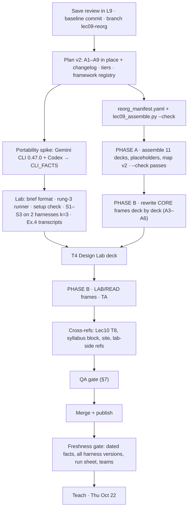

# Lec09 Reorg Plan — Critical Review and Amendments (inputs for plan v2)

Date: 2026-09-12 · Reviews `source/Lec09_Agentic_AI/Lec09_Reorg_Plan_2026-09-12.md` (v1, 633 lines)
Shorthand as in v1: **ROOT** = the repository root, **L9** = `ROOT/source/Lec09_Agentic_AI/`.

## 0. Context

You asked for critical comments that make v1 ready to implement and then to rewrite the Lecture 9 notes for
economists. I checked v1's claims against the repository, the CLIs and the course pages before judging it.

**Your decisions (asked 2026-09-12):**
- The notes being rewritten are **the eleven slide decks**. The 讲稿 stays a follow-up, as in v1 §14.
- The hands-on parts run **live on Oct 22 with mixed tools**: students bring Claude Code, Codex CLI, Gemini
  CLI or others.

**Verified correct in v1 (keep):**
- deck frame counts 17/16/26/40/15/19/23/22/17 = 195;
- the reconciliation arithmetic in §5.4 and Appendix A, and the new total of 220;
- Lec10_T8's inbound "Lec09 T3" lines 11, 235, 240, 269, 610;
- `tools/build_slides.py` name-boundary matching;
- T2b/T2c, the lab, `.claude/agents/` and `notes/` are untracked on `main`;
- the Claude Code surfaces the decks cite (`--agent`, `--agents`, `--bg`, `claude agents/logs/stop`, no
  `--max-turns`) all exist on 2.1.269.

**Bottom line.** The five-part structure and the frame inventory are the right base. Six problems need fixing
before implementation:
1. v1 is not planned against the **actual slot**.
2. The **lab and exercise are Claude-Code-only**, but the session runs on mixed tools.
3. The economics sits in the **examples, not the concepts**, and Lec10 T9 is missing.
4. v1 would **copy factual errors** forward in frames it marks KEEP.
5. The **Design Sprint** grades the wrong thing and gives away its own scenario.
6. The **implementation order** removes the teachable version before the new one exists.

## 1. Motivating examples — what goes wrong if v1 ships unchanged

1. **Thu Oct 22, 9:30.** `syllabus.html:53` gives Lectures 9 and 10 one 3-hour morning, and `:306` lists
   Lecture 9 as "(1 hr)". v1 has ≈220 frames and no must-teach marks, so cuts happen live. Part 5 is last and
   gets cut first. It holds T5a's 5-pillar spine, which the capstone calls "your scaffold on every track"
   (`source/Docs/Capstone_Projects_2026.md:33`).
2. **A student on Gemini CLI opens Part B, Step 2, and types `/agents`.**
   - Nothing there matches. The walkthrough is verified only on Claude Code (`TERMINAL_WALKTHROUGH.md:74,367`).
   - Its portability table is "stated from the shared mechanism rather than from a run" (`:383-386`).
   - Gemini CLI 0.47.0's help (installed on this machine) shows skills and headless JSON, but no custom
     sub-agents.
3. **A labour economist reads Failure Case 1** (`L9/Lec09_T5…:205`): "must cluster at county … SEs 2–4× too
   small". Minimum-wage treatment is mostly assigned by state, and the multiplier has no source. The same
   audience sees T1's table saying claude.ai cannot run Python (`T1:162`), and T6's "identification is
   categorically outside the system" (`T6:176`).
4. **The hook's top rung** is a claim that was four days old, reported by the vendor about an unreleased
   model, and disputed (`T2c:249-274`). The course already owns two better examples:
   - an audited 11,171-label economics run (Lec10 T6b);
   - "passed every gate, still wrong" (Lec10 T9, committed 2026-08-05).

   v1 never mentions T9.
5. **Sprint scenario S2.** Students watched the "rationalize" trap and the reviewer's answer in T2a an hour
   earlier. The planted "defect" (2001 and 2009 assigned to the outgoing party) is also a defensible lag
   convention, so a careful team would be marked wrong.
6. **Step 1 archives all nine decks before any new deck compiles.** The files that exist only on disk get
   committed at the very end (v1 decision 8). If the work is half done on Oct 19, the only teachable copy is
   whatever was published.

## 2. Amendments, ranked (problem → evidence → change to v1)

### A1 · Critical — plan against the Oct 22 slot, without cutting content
- **Problem:** v1 gives no mechanism for "drop at deployment" (about 10 `% OPTIONAL` marks) and no dates.
  Clock-fit not being the priority stays your call.
- **Change:**
  - Tag every frame `% TIER: CORE | LAB | READ`. CORE is the Oct 22 path, about 40–45 frames; nothing is deleted.
  - T5a's six steps, 5 pillars, restate-the-spec and V0 benchmark are CORE. The capstone, Lec10 T8 and T9
    depend on them.
  - Add `L9/Lec09_RunSheet_2026-10-22.md`: CORE frames, minutes per part, and the team roster by harness.
  - Add the dated schedule in §4.

### A2 · Critical — mixed tools: make the lab and the design exercise portable, and test on a second harness
- **Evidence:**
  - Rungs 1–2 need Claude Code's custom sub-agents (`.claude/agents/`, `/agents`, `--agent`), and S3 needs its
    hooks.
  - `agent_lab.py:241-275` probes only `claude`.
  - v1 parks the harness mapping in the appendix (TA item 12), copied from an unsourced archive table
    (`archive_pre_split/Lec09_Agentic_AI.tex:428-436`, e.g. `.agents/agents/`).
  - Available here: Gemini CLI 0.47.0 (`gemini skills list|enable|install|link`, `-p`,
    `--output-format json|stream-json`, `--approval-mode plan`, policy engine). Codex CLI is not installed
    (npm is).
- **Changes:**
  1. **Portability spike before any scenario is built.** Run each question, don't infer, on Gemini CLI 0.47.0
     and Codex CLI (install; needs your login):
     - which project-instructions file loads;
     - skill discovery, and how activation shows in `stream-json`;
     - custom sub-agent support (yes/no, where);
     - headless JSON output, read-only mode, tool policy, hooks.

     Record a three-column table with versions and date in `L9/CLI_FACTS_2026-09.md` (see A8.4).
  2. **A harness-neutral agent brief is the deliverable.** The eight canvas cells go into `briefs/<name>.md`,
     with front matter `name` and `description` and the tools written as intent. The brief compiles to
     whichever the harness supports:
     - a Claude Code sub-agent;
     - a skill (`SKILL.md`) where sub-agents are not native;
     - a headless prompt for rung 3 in any harness.
  3. **Acceptance test at rung 3 everywhere.** Each (brief × prompt × k=3) runs as one headless process,
     which is a fresh session by construction.
     - `labs/Lec09_Agent_Lab/scripts/detection_matrix.py --harness claude|gemini|codex` tallies the matrix
       and the dispatch/activation rate.
     - It reuses the `subprocess` pattern in `agent_lab.py:250-275`.
     - The rung-1 selection experiment ("narrow the description, selection stops") uses sub-agents in Claude
       Code and skills elsewhere; the spike confirms this.
  4. **S3 provenance gate:** a hook where the harness has hooks. Otherwise the same `require_source_url.py`
     runs inside the rung-3 runner. The slide says which is which.
  5. **Move the verified harness mapping from TA into T2b** as CORE, replacing the `.claude`-only tree side
     column. Each of T3b's three rung frames gets one verified line for the other harnesses (or "not native —
     use rung 3"). TA keeps only the dated install details.
  6. **Generalise `agent_lab.py` Tier 2.** The functions `claude_code_available/auth_check/ask` become a small
     `HARNESSES` table. Notebook Step 0 becomes the setup check that prints each student's route through
     Part B. Rewrite the walkthrough's Portability section as tested commands.
  7. **Pre-class (your action, by Oct 9):** tell students to install one tested harness, log in and run
     Step 0, and collect which harness each has. Form teams so each has at least one working harness.
     Students without one pair up; offline Part A and the canvas need no account.

### A3 · High — make "for economists" conceptual: a delegation-economics spine, and bring in Lec10 T9
- **Evidence that this is already your direction:**
  - `notes/09-04-2026.txt:130-136` frames auto-dispatch vs hand-wired as a principal–agent problem and as
    central planning.
  - Lec10 T9 has "This Is a Principal–Agent Problem" (`Lec10_T9…:607`), "Research Design Becomes Mechanism
    Design" (`:656`) and "Generation Is Cheap; Verification Is Scarce" (`:693`).
  - Lec09 already uses the idiom: "marginal research value = marginal token cost" (`T1b:171`), "an unattended
    agent … is a repeated trial" (`T1b:339`), "N is a verification choice" (`T2c:498`).
- **Change (a thin spine, not a restructure).** Each part keeps its student question and gains an *economic
  twin* on map v2 and in its bridge:

  | Part | Student question (v1) | Economic twin (add) |
  |---|---|---|
  | 9.1 SEE | what changed, why care? | relative prices moved: generation is cheap, verification is scarce |
  | 9.2 UNDER THE HOOD | how does it run, how do I start? | what am I paying for? Tokens are marginal cost; context is a scarce input whose cost grows with length |
  | 9.3 BUILD | how do I build and call one? | dividing the labour: specialisation by comparative advantage, isolated contexts as firm boundaries, coordination cost binds |
  | 9.4 DESIGN & VALIDATE | can I prove it works? | writing and auditing the contract: planted defects are audits, the detection matrix is monitoring, pass^k is reliability over repeated trials |
  | 9.5 RUN & GOVERN | run, catch mistakes, stay safe? | hidden action over months: gates as contingent milestones, tracing as monitoring, the Context Dilemma as a shared prior, red lines as non-contractible |

- **New frames:**
  - T1 [NEW, CORE] *Delegating to an Agent Is a Principal–Agent Problem*. One frame, with a pointer to T9.
    **Ownership:** Lec09 owns the lens; T9 owns the evidence.
  - T5c: Failure Case 0 gains a two-line pointer to T9's "passed every gate".
  - T5d's last frame closes on T9's line "the loophole was in the contract".
- **Update v1 references for T9:**
  - Add Lec10 T9 to v1 §3 hard dependencies, the §9 ownership map, and the §12 inbound check.
  - Edit T1-F11 (`T1:258,263`): "six cases / Cases 4–6" becomes seven cases.
- **Terminology guard:** one line in T1. "Agent" means three things in this course: the LLM in a loop, the
  household in Aiyagari/HA-Ramsey, and the agent in principal–agent theory. Keep the OPT Homo Silicus frame
  only as that disambiguation.
- **"Collaborate with AI" (ask #6) has no owner in v1 §9.** Assign it to T5b, which already has the contract
  and restate/audit/refine, with a pointer to Lec10 T5.

### A4 · High — rebuild the example ladder on the capability ladder
- **Problems:**
  - v1 §2 says the rungs are "ordered by how long the agent worked", but they run 6 min → 5 requests →
    1 week → weeks → 24 min → 88 h (not monotone).
  - Two ladders teach one idea twice.
  - Ex.5 is dated, non-economics and disputed.
  - Ex.6 is a story about building a deck.
  - Ex.4's reviewer text says "roughly this" (`T2b:1556`), and the repository holds no recorded transcript.
- **Change:** one ladder, one course-owned example per rung:

```
 RUNG      chat window        one agent,         one agent, files,   agent + human        team of              scripted fan-out
           (no harness)       one sitting        many sittings       gates, weeks         sub-agents           + a verifier
 EXAMPLE   Fellows in chat    Ex.1 six minutes   Ex.2 882 Fellows    Ex.3 HA-Ramsey       Ex.6 4-agent ledger  Lec10 T6b 11,171 labels
           (T1-F06)           → one figure       (provenance)        (3 discoveries)      (paid twice)         (rubric + adjudication)
 HUMAN     notices 4 breaks   asks, checks       redesigns variable  catches timing bug   writes 4 briefs      specs rubric, reads 12
 FAILS AT                                                            ▲ Ex.7 Lec10 T9: passed every gate, still wrong (the contract)
 ACROSS ALL RUNGS: Ex.4 GDP x party. A leading verb survives every rung and every harness
 DATED SIDEBAR (T3b §F + TA only, [hype], re-verify Oct 19): Navier-Stokes, 10^4 agents
```

- **Drops and moves:** T1 drops v1's NEW "Story 3 — Ten Thousand Agents" (`v1:202`). Navier–Stokes leaves T1.
- **Record Ex.4 for real, once,** on two harnesses. Save the transcripts to `labs/Lec09_Agent_Lab/transcripts/`
  and footnote the T2a slides. If a real run differs from the slides, the slides change.
  - Add an optional Part A step that replays the recording offline with `ScriptedModel`
    (`agent_lab.py:120`).

### A5 · High — fix the accuracy defects v1 would copy forward
| Frame (v1 tag) | Problem, with evidence | Change |
|---|---|---|
| T1-F07 (EDIT, table kept) | `T1:161-163`: claude.ai "Harness: none", "Can run Python? no", "Sees real errors? no". This contradicts `T1:120` ("running limited sandboxed tools") | Key the contrast on *whose environment* (vendor sandbox vs your machine, data and cluster), what persists, and the audit trail |
| NEW "Three Harnesses" + T1-F07 + T1-F10 | Three frames in the new T1 compare the same categories, which breaks v1 principle 3. "Why is Copilot not an agent?" (`v1:50,207`) is a false premise, since IDE assistants ship agent modes | Merge into **one** frame: where the loop runs, what it can touch, what persists, who presses run. One product can sit on several rungs |
| T1-F02 (KEEP) | `T1:59` "(9.3) method, (9.4) management, (9.5) your role" is wrong under the new parts, and v1's §12 greps cannot catch it | EDIT. Hand-review every `9\.[1-5]` hit |
| T1-F11 (KEEP) | `T1:258,263` still say "six cases" and "Cases 4–6" | EDIT (A3) |
| T5-F09 (KEEP) | `T5:205`: "cluster at county", "2–4× too small" | "Cluster at the level of treatment assignment (usually state here; Abadie et al. 2023)". Drop or source the multiplier |
| T6-F07 (MOVE) | `T6:176` "categorically outside the system" clashes with `T1:71` ("discoveries surfaced from the AI iteration") | Reframe as **non-delegable responsibility**, not incapability |
| T4-F15 (KEEP) + S3 | `T4:430-437`: a `PostToolUse` hook "rejects" a row, but PostToolUse fires after the write | Claude Code: `PreToolUse` on Write blocks; `PostToolUse` on Edit flags back. Wording: "blocked / flagged back". Verify on 2.1.269 |
| T5-F12 (MOVE) | `T5:271` cites "AEA disclosure policy (Oct. 2024)" with no source | Verify or remove (A8.5) |
| T1b-F09 → T1 (KEEP) | `T1b:226` horizons are for Opus 4.5 and GPT-5, which predate the current model generation | T1 keeps the concept; the numbers go to TA and are refreshed at the freshness gate |
| T6-F04 (OPT) | `T6:86-92` calls a rubric an "instrument", which economists will read as IV | Cut, or rewrite without IV vocabulary |
| T2c-F05, lab Step 8 | `T2c:239` "the ceiling is the agent file's `model:` line" | "No per-run turn-cap flag; budget through the model, the allowlist and the brief" |

### A6 · High — make T4 validate the design, not the dice
- **Problems:**
  - Rubric row 1 (`v1:357`) grades whether stochastic auto-dispatch *fired* in one run.
  - The lab's own matrix uses named dispatch (`TERMINAL_WALKTHROUGH.md:283-296`), which measures detection,
    not selection.
  - pass^k (`T1b:313-340`) lands in T5d, *after* the exercise.
  - S2 is pre-solved by T2a §C, and its off-by-one is a convention, not a defect.
  - "Sprint" already names Lec10 T6a/T6b.
- **Changes:**
  1. **Move T1b-F13** (*Single-Try Score vs Reliability Under Repetition*) **into T4** as the Validate method.
     - The rung-3 runner (A2.3) reports rates over k=3.
     - The rubric grades: canvas completeness; tools match blast radius; defect caught with `file:line`;
       control row silent; honest rates.
     - T5d keeps benchmark validity (T1b-F12). T2c-F08's "the sin T1b names" becomes "T4 names".
  2. **Make S2 a transfer case.** Same anatomy (fact, fact, plot, leading causal verb), new costume.
     - Example: FRED `FEDFUNDS` and CPI since 2000, "explain how the 2022–23 hikes brought inflation down".
     - Plant only defects that are unambiguous, such as a 12-month misalignment or a level used as a growth rate.
     - If GDP by party is kept instead, state the attribution convention in `brief.md`.
  3. **Rename T4** to *Design Lab: Your Agent for an Economics Task* (`Lec09_T4_Design_Lab.tex`).
  4. Every scenario must pass on **both tested harnesses** before it goes on the menu. S1 is the guaranteed one.

### A7 · Medium — curb framework inflation
- **Problem:** about 25 enumerated frameworks in Lec09 alone, among them four features, four orchestration
  patterns, four research patterns, three components, four moving parts, three error channels, eight steps,
  eight cells, three dials, three ceilings, three wirings, three rungs, twelve commands, four zones, three
  memories, three lifetimes, six instruments, six steps, five pillars, five plan criteria, seven tests, three
  operator mistakes, four mistakes at scale, and three things AI cannot do.
- **Change:**
  - Add a **framework registry** to plan v2: name, count, owner, cited by, tier.
  - **At most five named frameworks at CORE:** the loop; the eight-step build = the canvas (one object); the
    three rungs; the six homotopy steps with the 5 pillars; the seven tests.
  - The rest become unnumbered prose or READ tier, except names other lectures cite verbatim (v1 principle 8).

### A8 · Medium — implementation safety: baseline, branch, executable inventory, two phases
1. **Baseline commit on `main` first** (your approval covers this):
   - T2b/T2c `.tex` and `.pdf`, `labs/Lec09_Agent_Lab/`, `.claude/agents/`, `Lec09_manifest.txt`, the v1 plan,
     and this review.
   - **Not** `notes/`: the repository is public (`README.md`: "Unlisted, not secret").
   - This replaces v1 decision 8.
2. **Branch `lec09-reorg`**, and archive there with `git mv`. `main` stays teachable until the merge.
   Archived decks will not compile in `_archive/…` (`\input{../shared_preamble.tex}`); their PDFs are the reference.
3. **Make Appendix A executable.** `L9/reorg_manifest.yaml` maps each new deck to an ordered list of
   `{src, frame#, title, tag, tier, edits}`. `tools/lec09_assemble.py`:
   - splits old decks at top-level `\begin{frame}…\end{frame}` and `\sectiondivider`, then assembles the new ones;
   - `--check` asserts that every old frame is used once, merged or cut, and that KEEP frames diff clean
     apart from their listed reference edits.

   This replaces roughly 110 hand edits anchored to line numbers. At least one v1 index is already off
   (`v1:366` maps the cost curve to T2b-24; the outline has Tokens & Cost at T2b-23). The §7.3 lab↔slide map
   should use frame titles.
4. **One dated facts sheet,** `L9/CLI_FACTS_2026-09.md`: Claude Code 2.1.269 plus the A2.1 table. T2b, T3b,
   T4 and the lab cite it; the freshness gate re-runs it.
5. **Governance frame to add in T5d:** *Disclosure, Replication Packages, and `AI_LOG.md`*. Tie it to the
   capstone's `AI_LOG.md`, verify current journal and AEA policy text, and fix `T5:271`.
6. **Two phases.**
   - **Phase A — Assemble** (mechanical): KEEP/MOVE/CUT and reference-string edits. Each MERGE/NEW becomes a
     titled placeholder frame. Result: eleven decks that compile, pass `--check`, and serve as the fallback.
   - **Phase B — Rewrite** (the notes rewrite you asked for): deck by deck, CORE first. Covers merges, new
     frames and figures, the A3/A4/A5 content, and a prose pass to the §5 standard.

### A9 · Low — smaller corrections to v1
- The T3a header says "~22 + 2 opt", but the 22 already include F18/F19 (`v1:257`). It is 20 + 2.
- Map v2: `\LecNineMap{k}` cannot show which 9.5 sub-deck you are in. Use `\LecNineMap{5}{c}`.
- T5d: move the k=0 "Your Job Description" reprise (item 13 of 21) to just before the bridge.
- Links: one hub URL per deck (the site's `labs/index.html`) plus a QR code on T4's Links frame. Pin `file:line`
  references to a tag (`lec09-2026f`), not `main`.
- v1 §10 D: rewrite the whole Lecture 9 block (`syllabus.html:306-324`). Log the stale Lec10 case list.
- Cold open (Ex.1) is Goldsmith-Pinkham's: keep the attribution, URL (`Capstone_Projects_2026.md:526-528`) and date.

## 3. Revised structure (spec for plan v2 §5.1 and map v2)

```
 ┌──────────────┐  ┌────────────────────┐  ┌────────────────────┐  ┌───────────────────┐  ┌──────────────────────────┐
 │ 9.1 SEE      │─▶│ 9.2 UNDER THE HOOD │─▶│ 9.3 BUILD          │─▶│ 9.4 DESIGN &      │─▶│ 9.5 RUN & GOVERN         │
 │ T1           │  │ T2a  T2b           │  │ T3a  T3b           │  │  VALIDATE  T4 Lab │  │ T5a  T5b  T5c  T5d       │
 │ what changed?│  │ how does it run?   │  │ build & call one?  │  │ prove it works?   │  │ run · catch · govern     │
 │ ┄ generation │  │ ┄ what am I paying │  │ ┄ dividing the     │  │ ┄ write and audit │  │ ┄ hidden action over     │
 │   cheap,     │  │   for? tokens,     │  │   labour           │  │   the contract    │  │   months                 │
 │   verif.     │  │   scarce context   │  │                    │  │   (pass^k here)   │  │                          │
 │   scarce     │  │ harness map (CORE) │  │ rungs × harnesses  │  │ brief → any tool  │  │ 5 pillars · six steps    │
 └──────────────┘  └────────────────────┘  └────────────────────┘  └───────────────────┘  └──────────────────────────┘
        ╎                  ╎ Part A (+Ex.4 replay)   ╎ Part B (2 harnesses)  ╎ S1–S3 rung-3 runner     ╎ Lec10 T4·T6b·T8·T9
   Appendix TA (dated)
```

## 4. Implementation workflow (replaces the v1 §11 order; v1 §§5–10 stay, as amended above)



| # | Step | Latest by |
|---|---|---|
| 0 | Save this review as `L9/Lec09_Reorg_Plan_Review_2026-09-12.md`; baseline commit; branch | Sep 14 |
| 1 | Plan v2 edits in place with a changelog; manifest with tiers; framework registry | Sep 16 |
| 2 | Portability spike and CLI facts sheet; assembler dry run; map v2 compiled (k=1..5, sub-deck, k=0) | Sep 19 |
| 3 | **Phase A complete**: eleven decks compile, `--check` passes (fallback exists from here) | Sep 23 |
| 4 | Lab: brief format, rung-3 runner, setup check, S1–S3 on two harnesses, Ex.4 transcripts and replay | Oct 3 |
| 5 | Phase B, CORE frames in all decks, and the T4 deck | Oct 5 |
| 6 | Student setup announcement and harness survey (**your action**) | Oct 9 |
| 7 | Phase B LAB/READ frames and TA; content freeze | Oct 12 |
| 8 | v1 §10 A–K cross-refs; QA gate; merge; publish; links live | Oct 16 |
| 9 | Freshness gate; run sheet; teams by harness | Oct 20 |

## 5. Rewrite standard for Phase B (the decks are the notes)
1. One claim per frame, stated in the bold lead sentence (house voice). Every mechanism frame has a figure.
2. Each part's economic twin (A3) appears on its map frame and bridge. Frames name their thread or example
   where it is natural, not forced.
3. Concepts use harness-neutral words ("the harness", "your agent"). Claude Code is the running example.
   Anything students type goes in a verified box for the harnesses in use.
4. Every number carries an evidence tag and a source. Dated facts appear only in tagged frames or TA, with one
   `CLI_FACTS` footnote per deck.
5. No deck-history self-reference ("T2b's §2", "this deck's own", "four days old", "never ran"). Forward
   references say "returns to…".
6. At most five named frameworks at CORE (A7). CORE frames get polished first; READ frames need accuracy, not polish.

## 6. Decisions
- **Recorded:** the rewrite targets the eleven decks; the session is live with mixed tools (A2 follows from this).
- **Recommended, overridable when you approve:** the delegation-economics spine (A3), the capability ladder with
  Navier–Stokes demoted (A4), S2 as a transfer case (A6.2), the rename to Design Lab, and the baseline commit
  before archiving (A8.1).

## 7. Verification (adds to v1 §12)
- End of Phase A: `python3 tools/lec09_assemble.py --check` is clean. All eleven decks compile with pdflatex ×2,
  and `source/qa_page_numbers.sh` passes.
- Every frame has `% TIER:`. CORE totals 40–45, including T5a's 5 pillars, six steps and restate-the-spec.
- Must be empty in `L9/Lec09_T*.tex`: `six cases`, `Cases 4--6`, `Can run Python`, `cluster at county`,
  `categorically outside`, and "rejected" in the hook frame. Hand-review every `\b9\.[1-5]\b` hit.
- Must hit: `Lec10 T9`/`Case 7` in T1 and in T5c/T5d; the economic twin on every map frame; the harness mapping
  table in T2b.
- Course agents:
  - `boundary-auditor` on the ownership map (two full treatments of one topic is a defect);
  - `claim-checker` on every NEW or EDIT frame that contains a number.
- Web-verify, with a date, the external claims `claim-checker` cannot see: Navier–Stokes status, METR horizons,
  AEA/journal AI policy, the chat and IDE capability statements.
- Portability:
  - Step 0 detects and authenticates `claude`, `gemini` and `codex`.
  - `detection_matrix.py` runs S1–S3 at k=3 on each tested harness, catching every planted defect with a silent
    control row; record the rates.
  - The walkthrough's Portability section lists the commands as run, with version and date.
  - S3: Claude Code blocks a `Write` without `source_url`; the runner gate rejects it on the other harness.
- One dry run of the 50-minute Design Lab with two harnesses in the room.
- Links: `curl -sI` returns 200 after push; the QR code resolves; `tools/build_slides.py --check` and
  `tools/check_site.py` are clean.

## 8. Critical files
- **Amended:** v1 plan `L9/Lec09_Reorg_Plan_2026-09-12.md`; `L9/lec09_map.tex` (signature
  `\LecNineMap{part}{sub}`); `labs/Lec09_Agent_Lab/{agent_lab.py (Tier 2, lines 241–275), Lec09_Lab_Agents.ipynb
  (Step 0, Ex.4 replay), TERMINAL_WALKTHROUGH.md (Portability), AGENT_DESIGN_CANVAS.md (brief format)}`;
  `syllabus.html:306-324`.
- **New:** `L9/Lec09_Reorg_Plan_Review_2026-09-12.md`, `L9/reorg_manifest.yaml`, `tools/lec09_assemble.py`,
  `L9/CLI_FACTS_2026-09.md`, `L9/Lec09_RunSheet_2026-10-22.md`, `L9/Lec09_T4_Design_Lab.tex`,
  `labs/Lec09_Agent_Lab/{scripts/detection_matrix.py, briefs/, transcripts/, scenarios/}`.
- **Reused as is:** `ScriptedModel` (`agent_lab.py:120`), `.claude/agents/{boundary-auditor,claim-checker,
  deck-cartographer}.md`, `tools/build_slides.py --adopt/--check`, `source/qa_page_numbers.sh`. Lec10 T9 is
  read-only (pointers only).
